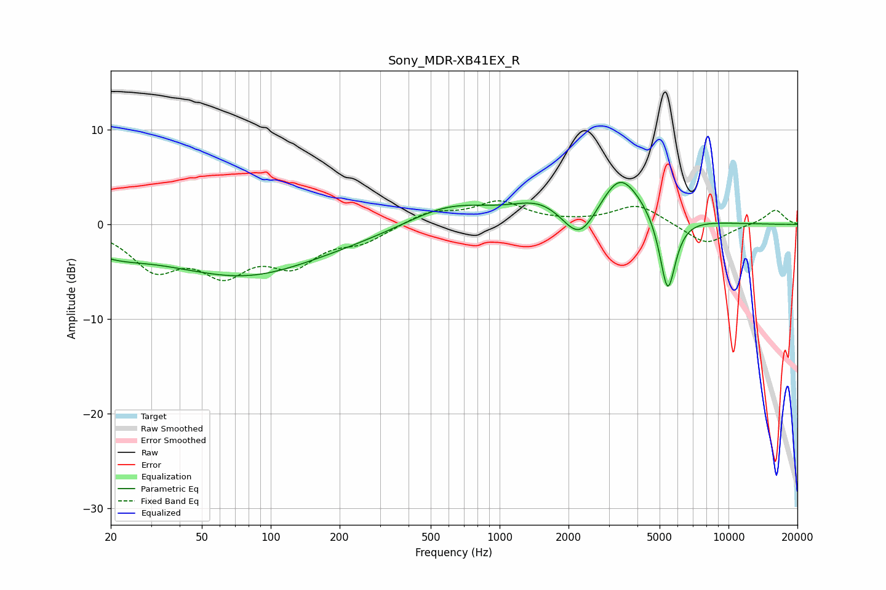

# Sony_MDR-XB41EX_R
See [usage instructions](https://github.com/jaakkopasanen/AutoEq#usage) for more options and info.

### Parametric EQs
Apply preamp of -4.5 dB when using parametric equalizer.

|   # | Type    |   Fc (Hz) |    Q |   Gain (dB) |
|-----|---------|-----------|------|-------------|
|   1 | Peaking |        20 | 1.08 |        -1.3 |
|   2 | Peaking |        31 | 0.46 |        -1.5 |
|   3 | Peaking |        82 | 0.48 |        -4.4 |
|   4 | Peaking |       234 | 0.56 |        -0.8 |
|   5 | Peaking |       605 | 0.76 |         2.2 |
|   6 | Peaking |      1522 | 1.14 |         2   |
|   7 | Peaking |      2244 | 1.79 |        -4.3 |
|   8 | Peaking |      3346 | 2.2  |         1.9 |
|   9 | Peaking |      3371 | 1.01 |         3.9 |
|  10 | Peaking |      5424 | 3.89 |        -8.5 |

### Fixed Band EQs
When using fixed band (also called graphic) equalizer, apply preamp of **-2.6 dB** (if available) and set gains manually with these parameters.

|   # | Type    |   Fc (Hz) |    Q |   Gain (dB) |
|-----|---------|-----------|------|-------------|
|   1 | Peaking |        31 | 1.41 |        -4.3 |
|   2 | Peaking |        62 | 1.41 |        -4.4 |
|   3 | Peaking |       125 | 1.41 |        -3.7 |
|   4 | Peaking |       250 | 1.41 |        -1.6 |
|   5 | Peaking |       500 | 1.41 |         1.3 |
|   6 | Peaking |      1000 | 1.41 |         2.3 |
|   7 | Peaking |      2000 | 1.41 |         0.1 |
|   8 | Peaking |      4000 | 1.41 |         2.1 |
|   9 | Peaking |      8000 | 1.41 |        -2.2 |
|  10 | Peaking |     16000 | 1.41 |         1.6 |

### Graphs

