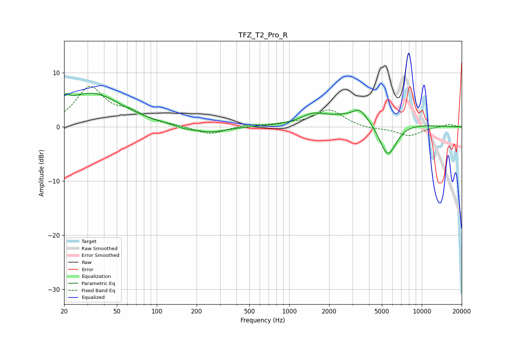

# TFZ_T2_Pro_R
See [usage instructions](https://github.com/jaakkopasanen/AutoEq#usage) for more options and info.

### Parametric EQs
Apply preamp of -6.3 dB when using parametric equalizer.

|   # | Type    |   Fc (Hz) |    Q |   Gain (dB) |
|-----|---------|-----------|------|-------------|
|   1 | Peaking |        20 | 0.5  |         1.5 |
|   2 | Peaking |        20 | 5.81 |        -2.2 |
|   3 | Peaking |        20 | 5.86 |         3.3 |
|   4 | Peaking |        34 | 0.65 |         5   |
|   5 | Peaking |       163 | 2.07 |        -0.5 |
|   6 | Peaking |       255 | 1.21 |        -1.1 |
|   7 | Peaking |      1510 | 1.63 |         1.5 |
|   8 | Peaking |      3397 | 3.18 |         1.5 |
|   9 | Peaking |      3808 | 0.54 |         2.9 |
|  10 | Peaking |      5526 | 1.94 |        -7.4 |

### Fixed Band EQs
When using fixed band (also called graphic) equalizer, apply preamp of **-7.6 dB** (if available) and set gains manually with these parameters.

|   # | Type    |   Fc (Hz) |    Q |   Gain (dB) |
|-----|---------|-----------|------|-------------|
|   1 | Peaking |        31 | 1.41 |         7.1 |
|   2 | Peaking |        62 | 1.41 |         2.2 |
|   3 | Peaking |       125 | 1.41 |         0.2 |
|   4 | Peaking |       250 | 1.41 |        -1.4 |
|   5 | Peaking |       500 | 1.41 |         0.3 |
|   6 | Peaking |      1000 | 1.41 |         0.4 |
|   7 | Peaking |      2000 | 1.41 |         3.2 |
|   8 | Peaking |      4000 | 1.41 |        -0.4 |
|   9 | Peaking |      8000 | 1.41 |        -1.6 |
|  10 | Peaking |     16000 | 1.41 |         0.5 |

### Graphs

