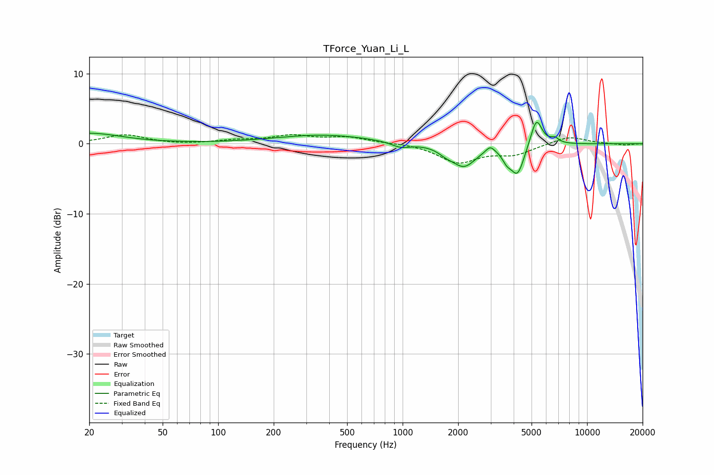

# TForce_Yuan_Li_L
See [usage instructions](https://github.com/jaakkopasanen/AutoEq#usage) for more options and info.

### Parametric EQs
Apply preamp of -3.2 dB when using parametric equalizer.

|   # | Type    |   Fc (Hz) |    Q |   Gain (dB) |
|-----|---------|-----------|------|-------------|
|   1 | Peaking |        20 | 0.82 |         1.5 |
|   2 | Peaking |       371 | 0.55 |         1.2 |
|   3 | Peaking |       978 | 2.74 |        -0.8 |
|   4 | Peaking |      1716 | 3.52 |        -0.6 |
|   5 | Peaking |      2149 | 2.16 |        -3.1 |
|   6 | Peaking |      2983 | 6    |         0.9 |
|   7 | Peaking |      3670 | 5.94 |        -1.2 |
|   8 | Peaking |      4196 | 3.78 |        -4.3 |
|   9 | Peaking |      5309 | 4.5  |         4   |
|  10 | Peaking |      6680 | 5.94 |         0.7 |

### Fixed Band EQs
When using fixed band (also called graphic) equalizer, apply preamp of **-1.4 dB** (if available) and set gains manually with these parameters.

|   # | Type    |   Fc (Hz) |    Q |   Gain (dB) |
|-----|---------|-----------|------|-------------|
|   1 | Peaking |        31 | 1.41 |         1.3 |
|   2 | Peaking |        62 | 1.41 |        -0.1 |
|   3 | Peaking |       125 | 1.41 |         0.4 |
|   4 | Peaking |       250 | 1.41 |         1.1 |
|   5 | Peaking |       500 | 1.41 |         0.9 |
|   6 | Peaking |      1000 | 1.41 |         0.1 |
|   7 | Peaking |      2000 | 1.41 |        -2.6 |
|   8 | Peaking |      4000 | 1.41 |        -1.4 |
|   9 | Peaking |      8000 | 1.41 |         1.1 |
|  10 | Peaking |     16000 | 1.41 |        -0.2 |

### Graphs

