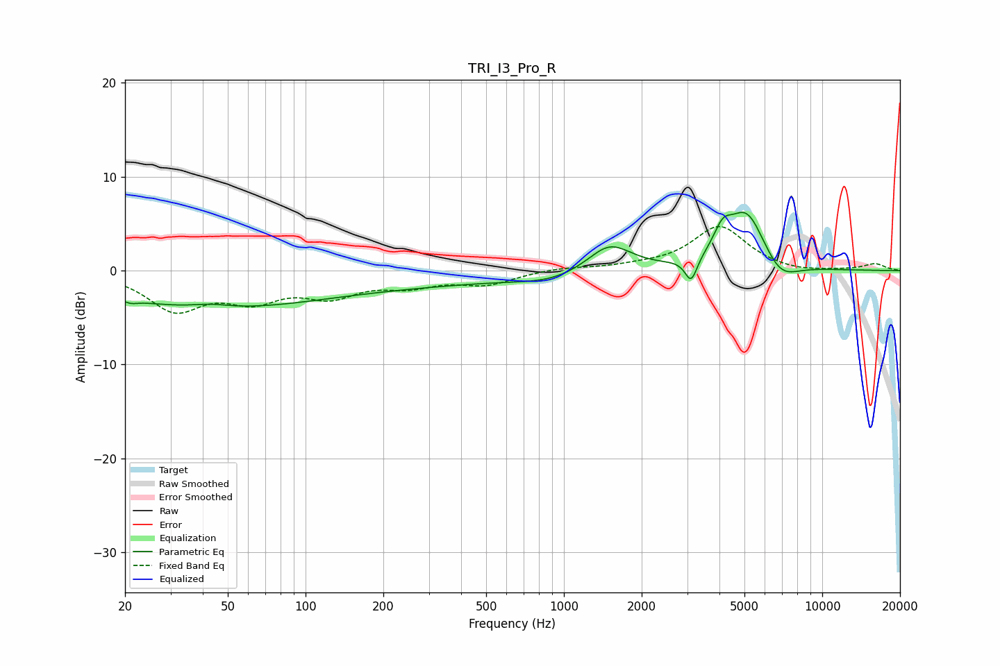

# TRI_I3_Pro_R
See [usage instructions](https://github.com/jaakkopasanen/AutoEq#usage) for more options and info.

### Parametric EQs
Apply preamp of -6.3 dB when using parametric equalizer.

|   # | Type    |   Fc (Hz) |    Q |   Gain (dB) |
|-----|---------|-----------|------|-------------|
|   1 | Peaking |        21 | 5.4  |        -0.4 |
|   2 | Peaking |        37 | 0.34 |        -3.6 |
|   3 | Peaking |        43 | 1.99 |         0.4 |
|   4 | Peaking |       204 | 0.31 |        -1.4 |
|   5 | Peaking |       896 | 1.01 |        -0.9 |
|   6 | Peaking |      1502 | 1.65 |         3   |
|   7 | Peaking |      3109 | 6    |        -2.6 |
|   8 | Peaking |      4117 | 4.06 |         2.3 |
|   9 | Peaking |      5096 | 1.8  |         6.4 |
|  10 | Peaking |      6834 | 1.96 |        -2.3 |

### Fixed Band EQs
When using fixed band (also called graphic) equalizer, apply preamp of **-4.8 dB** (if available) and set gains manually with these parameters.

|   # | Type    |   Fc (Hz) |    Q |   Gain (dB) |
|-----|---------|-----------|------|-------------|
|   1 | Peaking |        31 | 1.41 |        -3.9 |
|   2 | Peaking |        62 | 1.41 |        -2.7 |
|   3 | Peaking |       125 | 1.41 |        -2.3 |
|   4 | Peaking |       250 | 1.41 |        -1.3 |
|   5 | Peaking |       500 | 1.41 |        -1.3 |
|   6 | Peaking |      1000 | 1.41 |         0.3 |
|   7 | Peaking |      2000 | 1.41 |         0.3 |
|   8 | Peaking |      4000 | 1.41 |         4.7 |
|   9 | Peaking |      8000 | 1.41 |        -0.3 |
|  10 | Peaking |     16000 | 1.41 |         0.7 |

### Graphs

