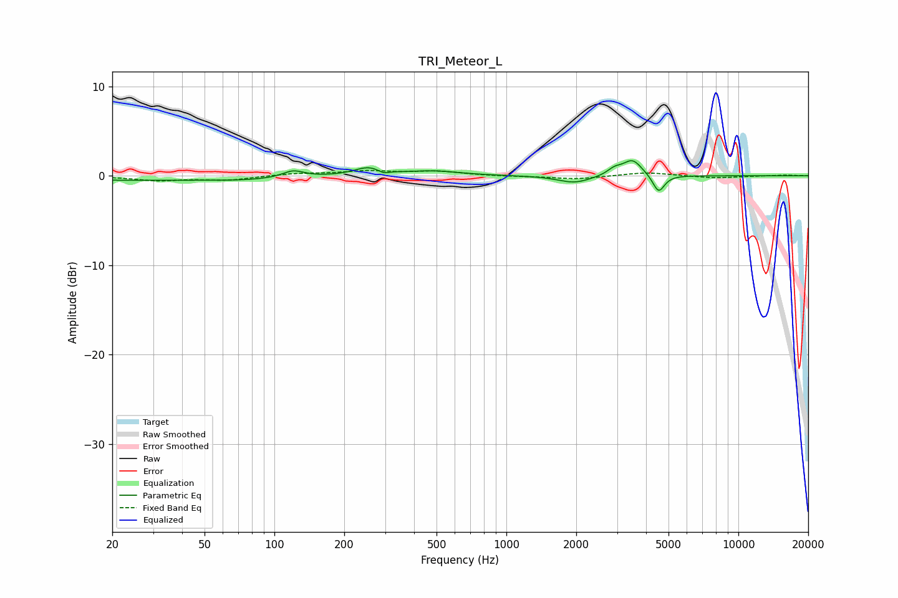

# TRI_Meteor_L
See [usage instructions](https://github.com/jaakkopasanen/AutoEq#usage) for more options and info.

### Parametric EQs
Apply preamp of -1.8 dB when using parametric equalizer.

|   # | Type    |   Fc (Hz) |    Q |   Gain (dB) |
|-----|---------|-----------|------|-------------|
|   1 | Peaking |        21 | 0.49 |        -0.4 |
|   2 | Peaking |        74 | 0.67 |        -0.4 |
|   3 | Peaking |       121 | 3.07 |         0.8 |
|   4 | Peaking |       255 | 2.31 |         0.9 |
|   5 | Peaking |       295 | 6    |        -0.4 |
|   6 | Peaking |       485 | 1.25 |         0.5 |
|   7 | Peaking |      1965 | 2    |        -0.8 |
|   8 | Peaking |      2926 | 4.64 |         0.7 |
|   9 | Peaking |      3498 | 3.47 |         1.8 |
|  10 | Peaking |      4532 | 5.67 |        -2   |

### Fixed Band EQs
When using fixed band (also called graphic) equalizer, apply preamp of **-0.7 dB** (if available) and set gains manually with these parameters.

|   # | Type    |   Fc (Hz) |    Q |   Gain (dB) |
|-----|---------|-----------|------|-------------|
|   1 | Peaking |        31 | 1.41 |        -0.5 |
|   2 | Peaking |        62 | 1.41 |        -0.5 |
|   3 | Peaking |       125 | 1.41 |         0.3 |
|   4 | Peaking |       250 | 1.41 |         0.5 |
|   5 | Peaking |       500 | 1.41 |         0.5 |
|   6 | Peaking |      1000 | 1.41 |        -0.1 |
|   7 | Peaking |      2000 | 1.41 |        -0.4 |
|   8 | Peaking |      4000 | 1.41 |         0.4 |
|   9 | Peaking |      8000 | 1.41 |        -0.3 |
|  10 | Peaking |     16000 | 1.41 |         0.1 |

### Graphs

