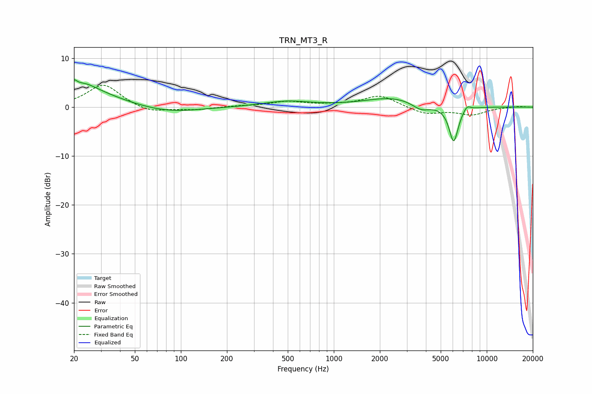

# TRN_MT3_R
See [usage instructions](https://github.com/jaakkopasanen/AutoEq#usage) for more options and info.

### Parametric EQs
Apply preamp of -5.7 dB when using parametric equalizer.

|   # | Type    |   Fc (Hz) |    Q |   Gain (dB) |
|-----|---------|-----------|------|-------------|
|   1 | Peaking |        20 | 5.81 |         3.1 |
|   2 | Peaking |        21 | 5.99 |        -2   |
|   3 | Peaking |        22 | 0.68 |         3.9 |
|   4 | Peaking |        24 | 2.17 |         0.9 |
|   5 | Peaking |        82 | 0.72 |        -1.3 |
|   6 | Peaking |       492 | 0.9  |         1.1 |
|   7 | Peaking |      2438 | 0.78 |         1.9 |
|   8 | Peaking |      3717 | 2.42 |        -1.5 |
|   9 | Peaking |      6077 | 4.5  |        -7.4 |
|  10 | Peaking |      7414 | 5.77 |         1.1 |

### Fixed Band EQs
When using fixed band (also called graphic) equalizer, apply preamp of **-4.5 dB** (if available) and set gains manually with these parameters.

|   # | Type    |   Fc (Hz) |    Q |   Gain (dB) |
|-----|---------|-----------|------|-------------|
|   1 | Peaking |        31 | 1.41 |         4.7 |
|   2 | Peaking |        62 | 1.41 |        -1.3 |
|   3 | Peaking |       125 | 1.41 |        -0.5 |
|   4 | Peaking |       250 | 1.41 |         0.2 |
|   5 | Peaking |       500 | 1.41 |         1.1 |
|   6 | Peaking |      1000 | 1.41 |         0.3 |
|   7 | Peaking |      2000 | 1.41 |         2.4 |
|   8 | Peaking |      4000 | 1.41 |        -1.5 |
|   9 | Peaking |      8000 | 1.41 |        -1.5 |
|  10 | Peaking |     16000 | 1.41 |         0.2 |

### Graphs

