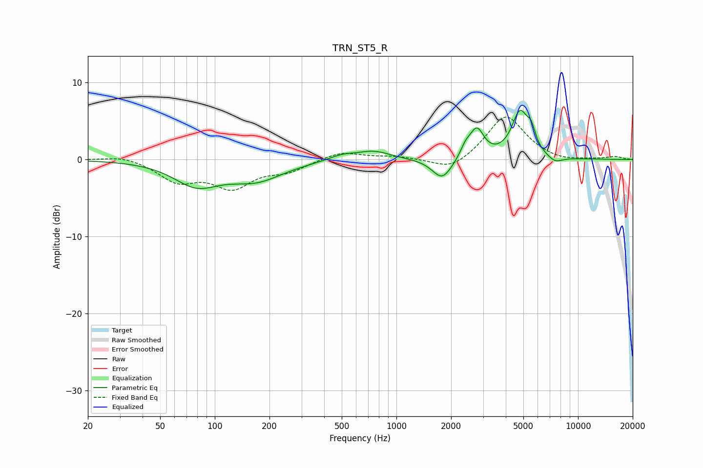

# TRN_ST5_R
See [usage instructions](https://github.com/jaakkopasanen/AutoEq#usage) for more options and info.

### Parametric EQs
Apply preamp of -6.5 dB when using parametric equalizer.

|   # | Type    |   Fc (Hz) |    Q |   Gain (dB) |
|-----|---------|-----------|------|-------------|
|   1 | Peaking |        79 | 1.14 |        -3   |
|   2 | Peaking |       169 | 0.94 |        -2.4 |
|   3 | Peaking |       501 | 1.9  |         0.7 |
|   4 | Peaking |       750 | 1.53 |         1.1 |
|   5 | Peaking |      1788 | 2.59 |        -2.8 |
|   6 | Peaking |      2402 | 5.05 |         1.2 |
|   7 | Peaking |      2772 | 3.61 |         3.7 |
|   8 | Peaking |      4793 | 3.03 |         5.8 |
|   9 | Peaking |      5529 | 5.95 |         2   |
|  10 | Peaking |      7465 | 3.31 |        -0.8 |

### Fixed Band EQs
When using fixed band (also called graphic) equalizer, apply preamp of **-5.6 dB** (if available) and set gains manually with these parameters.

|   # | Type    |   Fc (Hz) |    Q |   Gain (dB) |
|-----|---------|-----------|------|-------------|
|   1 | Peaking |        31 | 1.41 |         0.6 |
|   2 | Peaking |        62 | 1.41 |        -2.6 |
|   3 | Peaking |       125 | 1.41 |        -3.3 |
|   4 | Peaking |       250 | 1.41 |        -1.3 |
|   5 | Peaking |       500 | 1.41 |         1.1 |
|   6 | Peaking |      1000 | 1.41 |         0.4 |
|   7 | Peaking |      2000 | 1.41 |        -1.6 |
|   8 | Peaking |      4000 | 1.41 |         5.8 |
|   9 | Peaking |      8000 | 1.41 |        -0.4 |
|  10 | Peaking |     16000 | 1.41 |         0.4 |

### Graphs

