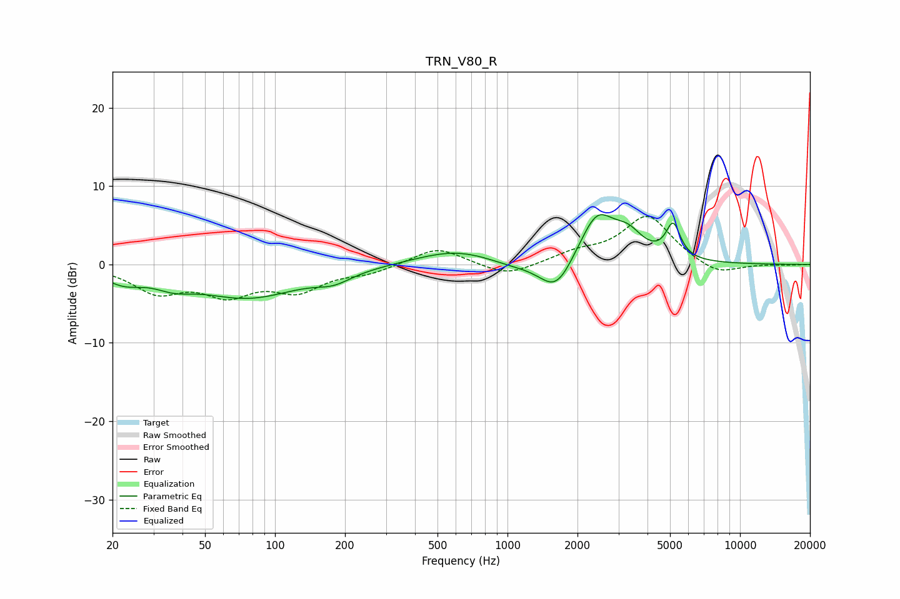

# TRN_V80_R
See [usage instructions](https://github.com/jaakkopasanen/AutoEq#usage) for more options and info.

### Parametric EQs
Apply preamp of -6.5 dB when using parametric equalizer.

|   # | Type    |   Fc (Hz) |    Q |   Gain (dB) |
|-----|---------|-----------|------|-------------|
|   1 | Peaking |        22 | 1.72 |        -1.7 |
|   2 | Peaking |        37 | 1.76 |        -1.3 |
|   3 | Peaking |        76 | 0.63 |        -4.1 |
|   4 | Peaking |       179 | 1.84 |        -1.2 |
|   5 | Peaking |       597 | 0.84 |         1.9 |
|   6 | Peaking |      1030 | 1.35 |        -0.6 |
|   7 | Peaking |      1621 | 1.91 |        -4.4 |
|   8 | Peaking |      2423 | 1.82 |         6.4 |
|   9 | Peaking |      3309 | 2.22 |         2.7 |
|  10 | Peaking |      5157 | 4.5  |         4.3 |

### Fixed Band EQs
When using fixed band (also called graphic) equalizer, apply preamp of **-6.2 dB** (if available) and set gains manually with these parameters.

|   # | Type    |   Fc (Hz) |    Q |   Gain (dB) |
|-----|---------|-----------|------|-------------|
|   1 | Peaking |        31 | 1.41 |        -3.3 |
|   2 | Peaking |        62 | 1.41 |        -3.4 |
|   3 | Peaking |       125 | 1.41 |        -3   |
|   4 | Peaking |       250 | 1.41 |        -1   |
|   5 | Peaking |       500 | 1.41 |         2.3 |
|   6 | Peaking |      1000 | 1.41 |        -1.6 |
|   7 | Peaking |      2000 | 1.41 |         1.3 |
|   8 | Peaking |      4000 | 1.41 |         6.2 |
|   9 | Peaking |      8000 | 1.41 |        -1.6 |
|  10 | Peaking |     16000 | 1.41 |        -0.1 |

### Graphs

