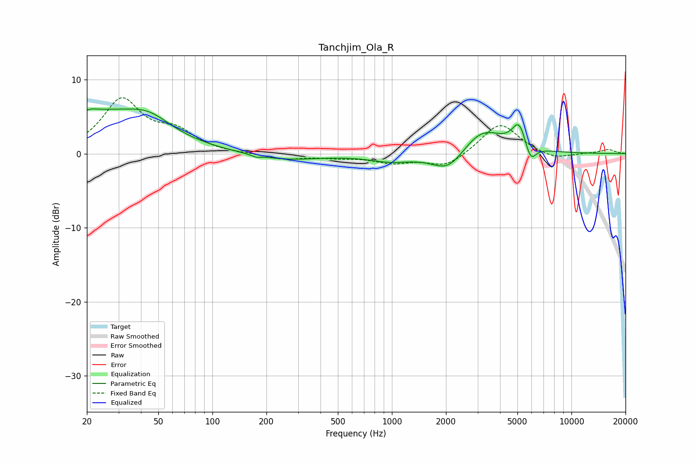

# Tanchjim_Ola_R
See [usage instructions](https://github.com/jaakkopasanen/AutoEq#usage) for more options and info.

### Parametric EQs
Apply preamp of -6.1 dB when using parametric equalizer.

|   # | Type    |   Fc (Hz) |    Q |   Gain (dB) |
|-----|---------|-----------|------|-------------|
|   1 | Peaking |        21 | 4.68 |         0.3 |
|   2 | Peaking |        23 | 0.46 |         5.3 |
|   3 | Peaking |        44 | 1.22 |         2   |
|   4 | Peaking |       175 | 5.92 |        -0.3 |
|   5 | Peaking |       251 | 0.71 |        -0.9 |
|   6 | Peaking |       990 | 1.17 |        -1   |
|   7 | Peaking |      2065 | 1.54 |        -2.9 |
|   8 | Peaking |      3185 | 1.22 |         3.5 |
|   9 | Peaking |      5110 | 3.57 |         3.4 |
|  10 | Peaking |      5917 | 4.62 |        -2.4 |

### Fixed Band EQs
When using fixed band (also called graphic) equalizer, apply preamp of **-7.6 dB** (if available) and set gains manually with these parameters.

|   # | Type    |   Fc (Hz) |    Q |   Gain (dB) |
|-----|---------|-----------|------|-------------|
|   1 | Peaking |        31 | 1.41 |         7.1 |
|   2 | Peaking |        62 | 1.41 |         2.5 |
|   3 | Peaking |       125 | 1.41 |        -0   |
|   4 | Peaking |       250 | 1.41 |        -0.8 |
|   5 | Peaking |       500 | 1.41 |        -0.4 |
|   6 | Peaking |      1000 | 1.41 |        -1.1 |
|   7 | Peaking |      2000 | 1.41 |        -1.8 |
|   8 | Peaking |      4000 | 1.41 |         4.2 |
|   9 | Peaking |      8000 | 1.41 |        -0.9 |
|  10 | Peaking |     16000 | 1.41 |         0.5 |

### Graphs

