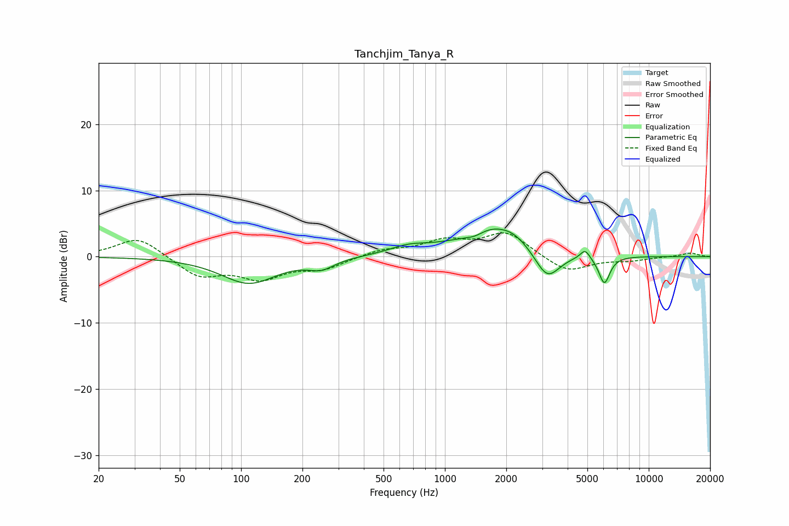

# Tanchjim_Tanya_R
See [usage instructions](https://github.com/jaakkopasanen/AutoEq#usage) for more options and info.

### Parametric EQs
Apply preamp of -4.3 dB when using parametric equalizer.

|   # | Type    |   Fc (Hz) |    Q |   Gain (dB) |
|-----|---------|-----------|------|-------------|
|   1 | Peaking |       109 | 1.05 |        -4   |
|   2 | Peaking |       247 | 2.25 |        -1.4 |
|   3 | Peaking |       663 | 1.49 |         1.1 |
|   4 | Peaking |      1221 | 2.04 |        -0.3 |
|   5 | Peaking |      1405 | 3.24 |        -0.7 |
|   6 | Peaking |      1687 | 0.86 |         4.5 |
|   7 | Peaking |      2185 | 2.04 |         0.8 |
|   8 | Peaking |      3176 | 2.25 |        -4.6 |
|   9 | Peaking |      4871 | 6    |         1.5 |
|  10 | Peaking |      6056 | 5.09 |        -4.2 |

### Fixed Band EQs
When using fixed band (also called graphic) equalizer, apply preamp of **-3.7 dB** (if available) and set gains manually with these parameters.

|   # | Type    |   Fc (Hz) |    Q |   Gain (dB) |
|-----|---------|-----------|------|-------------|
|   1 | Peaking |        31 | 1.41 |         3.1 |
|   2 | Peaking |        62 | 1.41 |        -2.9 |
|   3 | Peaking |       125 | 1.41 |        -3   |
|   4 | Peaking |       250 | 1.41 |        -1.7 |
|   5 | Peaking |       500 | 1.41 |         1   |
|   6 | Peaking |      1000 | 1.41 |         2.2 |
|   7 | Peaking |      2000 | 1.41 |         3.6 |
|   8 | Peaking |      4000 | 1.41 |        -2.5 |
|   9 | Peaking |      8000 | 1.41 |        -0.5 |
|  10 | Peaking |     16000 | 1.41 |         0.6 |

### Graphs

