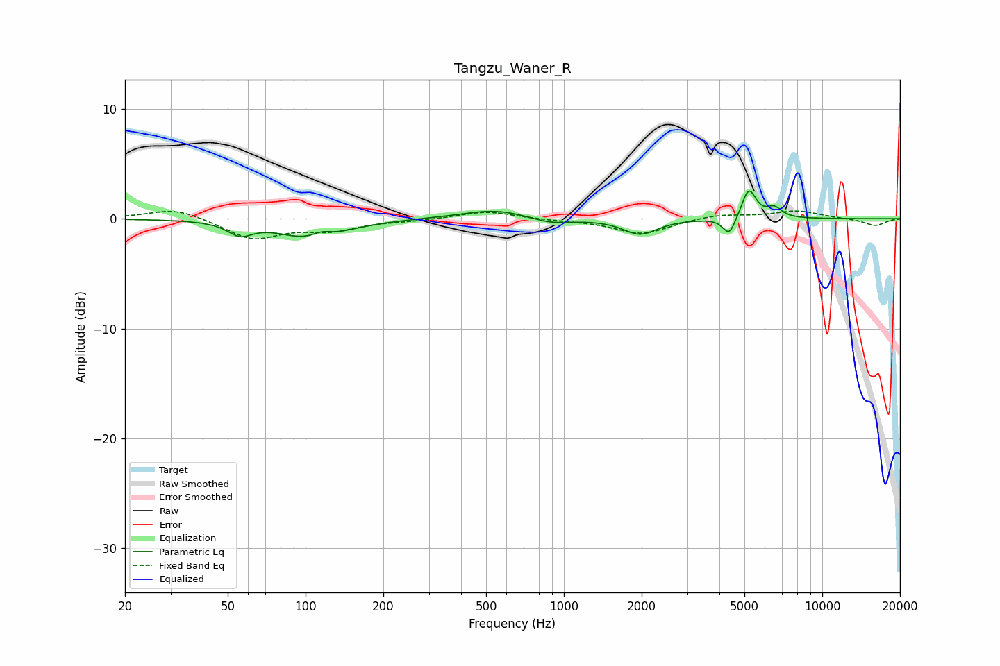

# Tangzu_Waner_R
See [usage instructions](https://github.com/jaakkopasanen/AutoEq#usage) for more options and info.

### Parametric EQs
Apply preamp of -2.6 dB when using parametric equalizer.

|   # | Type    |   Fc (Hz) |    Q |   Gain (dB) |
|-----|---------|-----------|------|-------------|
|   1 | Peaking |        56 | 3.06 |        -1.1 |
|   2 | Peaking |       107 | 1.18 |        -1.9 |
|   3 | Peaking |       115 | 3.42 |         0.7 |
|   4 | Peaking |       531 | 1.1  |         0.7 |
|   5 | Peaking |       597 | 1.21 |         0.1 |
|   6 | Peaking |       886 | 1.74 |        -0.6 |
|   7 | Peaking |      1974 | 2.14 |        -1.4 |
|   8 | Peaking |      4367 | 5.77 |        -1.7 |
|   9 | Peaking |      5199 | 5.1  |         2.7 |
|  10 | Peaking |      6522 | 4.72 |         0.9 |

### Fixed Band EQs
When using fixed band (also called graphic) equalizer, apply preamp of **-0.8 dB** (if available) and set gains manually with these parameters.

|   # | Type    |   Fc (Hz) |    Q |   Gain (dB) |
|-----|---------|-----------|------|-------------|
|   1 | Peaking |        31 | 1.41 |         1   |
|   2 | Peaking |        62 | 1.41 |        -1.8 |
|   3 | Peaking |       125 | 1.41 |        -0.9 |
|   4 | Peaking |       250 | 1.41 |        -0.1 |
|   5 | Peaking |       500 | 1.41 |         0.7 |
|   6 | Peaking |      1000 | 1.41 |        -0.1 |
|   7 | Peaking |      2000 | 1.41 |        -1.4 |
|   8 | Peaking |      4000 | 1.41 |         0.4 |
|   9 | Peaking |      8000 | 1.41 |         0.7 |
|  10 | Peaking |     16000 | 1.41 |        -0.6 |

### Graphs

