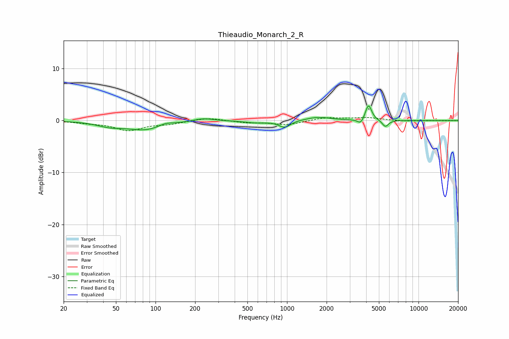

# Thieaudio_Monarch_2_R
See [usage instructions](https://github.com/jaakkopasanen/AutoEq#usage) for more options and info.

### Parametric EQs
Apply preamp of -2.9 dB when using parametric equalizer.

|   # | Type    |   Fc (Hz) |    Q |   Gain (dB) |
|-----|---------|-----------|------|-------------|
|   1 | Peaking |        45 | 1.5  |        -0.8 |
|   2 | Peaking |        85 | 0.97 |        -1.8 |
|   3 | Peaking |       118 | 2.4  |         0.6 |
|   4 | Peaking |       232 | 1.8  |         0.6 |
|   5 | Peaking |       581 | 1.64 |        -0.4 |
|   6 | Peaking |       959 | 3.24 |        -1.3 |
|   7 | Peaking |      1727 | 1.52 |         0.7 |
|   8 | Peaking |      3635 | 6    |        -1   |
|   9 | Peaking |      4166 | 6    |         3.1 |
|  10 | Peaking |      5593 | 5.9  |        -1.3 |

### Fixed Band EQs
When using fixed band (also called graphic) equalizer, apply preamp of **-0.7 dB** (if available) and set gains manually with these parameters.

|   # | Type    |   Fc (Hz) |    Q |   Gain (dB) |
|-----|---------|-----------|------|-------------|
|   1 | Peaking |        31 | 1.41 |        -0.4 |
|   2 | Peaking |        62 | 1.41 |        -1.8 |
|   3 | Peaking |       125 | 1.41 |        -0.6 |
|   4 | Peaking |       250 | 1.41 |         0.6 |
|   5 | Peaking |       500 | 1.41 |        -0.4 |
|   6 | Peaking |      1000 | 1.41 |        -0.8 |
|   7 | Peaking |      2000 | 1.41 |         0.6 |
|   8 | Peaking |      4000 | 1.41 |         0.5 |
|   9 | Peaking |      8000 | 1.41 |        -0.1 |
|  10 | Peaking |     16000 | 1.41 |        -0   |

### Graphs

