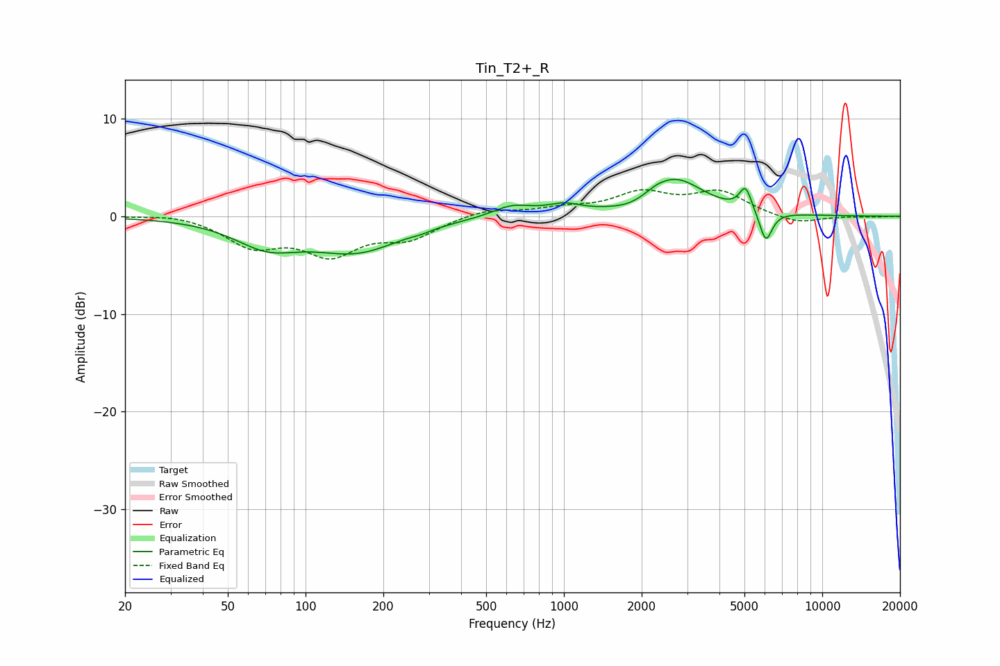

# Tin_T2+_R
See [usage instructions](https://github.com/jaakkopasanen/AutoEq#usage) for more options and info.

### Parametric EQs
Apply preamp of -3.9 dB when using parametric equalizer.

|   # | Type    |   Fc (Hz) |    Q |   Gain (dB) |
|-----|---------|-----------|------|-------------|
|   1 | Peaking |        71 | 1.11 |        -2.6 |
|   2 | Peaking |       158 | 0.82 |        -3.3 |
|   3 | Peaking |       280 | 3.85 |        -0.2 |
|   4 | Peaking |       630 | 1.83 |         1.1 |
|   5 | Peaking |       999 | 2.18 |         0.9 |
|   6 | Peaking |      1825 | 1.95 |        -0.7 |
|   7 | Peaking |      2270 | 5.15 |         0.1 |
|   8 | Peaking |      2659 | 1.23 |         3.9 |
|   9 | Peaking |      5049 | 5.91 |         2.4 |
|  10 | Peaking |      6047 | 5.62 |        -3.2 |

### Fixed Band EQs
When using fixed band (also called graphic) equalizer, apply preamp of **-2.8 dB** (if available) and set gains manually with these parameters.

|   # | Type    |   Fc (Hz) |    Q |   Gain (dB) |
|-----|---------|-----------|------|-------------|
|   1 | Peaking |        31 | 1.41 |         0.4 |
|   2 | Peaking |        62 | 1.41 |        -2.8 |
|   3 | Peaking |       125 | 1.41 |        -3.5 |
|   4 | Peaking |       250 | 1.41 |        -2   |
|   5 | Peaking |       500 | 1.41 |         0.8 |
|   6 | Peaking |      1000 | 1.41 |         0.7 |
|   7 | Peaking |      2000 | 1.41 |         2.2 |
|   8 | Peaking |      4000 | 1.41 |         2.4 |
|   9 | Peaking |      8000 | 1.41 |        -0.8 |
|  10 | Peaking |     16000 | 1.41 |        -0.1 |

### Graphs

