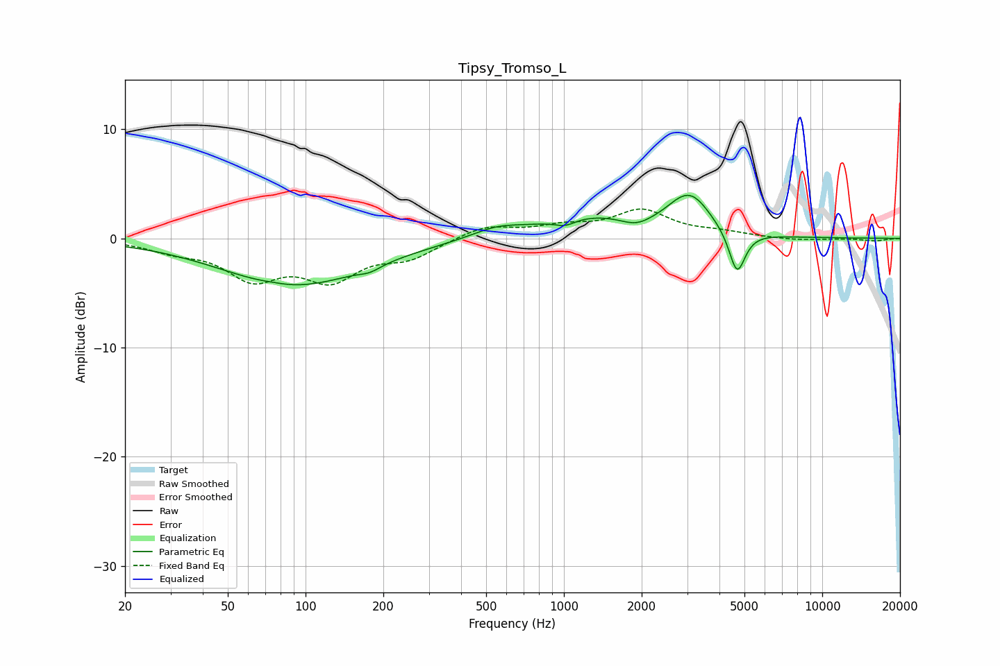

# Tipsy_Tromso_L
See [usage instructions](https://github.com/jaakkopasanen/AutoEq#usage) for more options and info.

### Parametric EQs
Apply preamp of -4.0 dB when using parametric equalizer.

|   # | Type    |   Fc (Hz) |    Q |   Gain (dB) |
|-----|---------|-----------|------|-------------|
|   1 | Peaking |        74 | 3.48 |         0.1 |
|   2 | Peaking |        91 | 0.5  |        -4.3 |
|   3 | Peaking |       177 | 3.41 |        -0.4 |
|   4 | Peaking |       549 | 1.44 |         0.8 |
|   5 | Peaking |      1010 | 3.43 |        -0.6 |
|   6 | Peaking |      1269 | 0.71 |         1.9 |
|   7 | Peaking |      1906 | 2.44 |        -0.7 |
|   8 | Peaking |      3012 | 3.34 |        -0.4 |
|   9 | Peaking |      3053 | 1.85 |         4   |
|  10 | Peaking |      4681 | 4.5  |        -4   |

### Fixed Band EQs
When using fixed band (also called graphic) equalizer, apply preamp of **-2.8 dB** (if available) and set gains manually with these parameters.

|   # | Type    |   Fc (Hz) |    Q |   Gain (dB) |
|-----|---------|-----------|------|-------------|
|   1 | Peaking |        31 | 1.41 |        -0.9 |
|   2 | Peaking |        62 | 1.41 |        -3.3 |
|   3 | Peaking |       125 | 1.41 |        -3.4 |
|   4 | Peaking |       250 | 1.41 |        -1.6 |
|   5 | Peaking |       500 | 1.41 |         1.2 |
|   6 | Peaking |      1000 | 1.41 |         0.9 |
|   7 | Peaking |      2000 | 1.41 |         2.4 |
|   8 | Peaking |      4000 | 1.41 |         0.4 |
|   9 | Peaking |      8000 | 1.41 |        -0.2 |
|  10 | Peaking |     16000 | 1.41 |        -0.2 |

### Graphs

