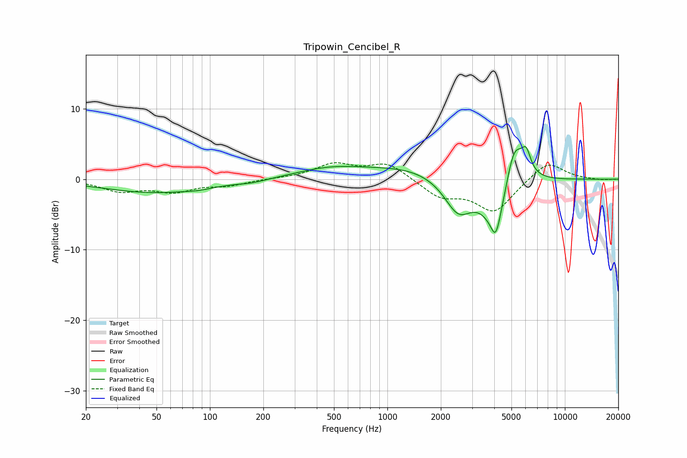

# Tripowin_Cencibel_R
See [usage instructions](https://github.com/jaakkopasanen/AutoEq#usage) for more options and info.

### Parametric EQs
Apply preamp of -4.7 dB when using parametric equalizer.

|   # | Type    |   Fc (Hz) |    Q |   Gain (dB) |
|-----|---------|-----------|------|-------------|
|   1 | Peaking |        49 | 0.48 |        -1.9 |
|   2 | Peaking |        86 | 2.11 |        -0.2 |
|   3 | Peaking |       173 | 1.82 |        -0.3 |
|   4 | Peaking |       474 | 0.74 |         1.4 |
|   5 | Peaking |      1347 | 0.58 |         1.6 |
|   6 | Peaking |      2507 | 1.77 |        -4.9 |
|   7 | Peaking |      4074 | 6    |        -2.5 |
|   8 | Peaking |      4145 | 1.86 |        -7.4 |
|   9 | Peaking |      5167 | 2.48 |         7.6 |
|  10 | Peaking |      6061 | 5.64 |         2.7 |

### Fixed Band EQs
When using fixed band (also called graphic) equalizer, apply preamp of **-2.4 dB** (if available) and set gains manually with these parameters.

|   # | Type    |   Fc (Hz) |    Q |   Gain (dB) |
|-----|---------|-----------|------|-------------|
|   1 | Peaking |        31 | 1.41 |        -1.6 |
|   2 | Peaking |        62 | 1.41 |        -1.6 |
|   3 | Peaking |       125 | 1.41 |        -0.8 |
|   4 | Peaking |       250 | 1.41 |         0.1 |
|   5 | Peaking |       500 | 1.41 |         2   |
|   6 | Peaking |      1000 | 1.41 |         2.3 |
|   7 | Peaking |      2000 | 1.41 |        -2.4 |
|   8 | Peaking |      4000 | 1.41 |        -4.5 |
|   9 | Peaking |      8000 | 1.41 |         2.7 |
|  10 | Peaking |     16000 | 1.41 |        -0.1 |

### Graphs

