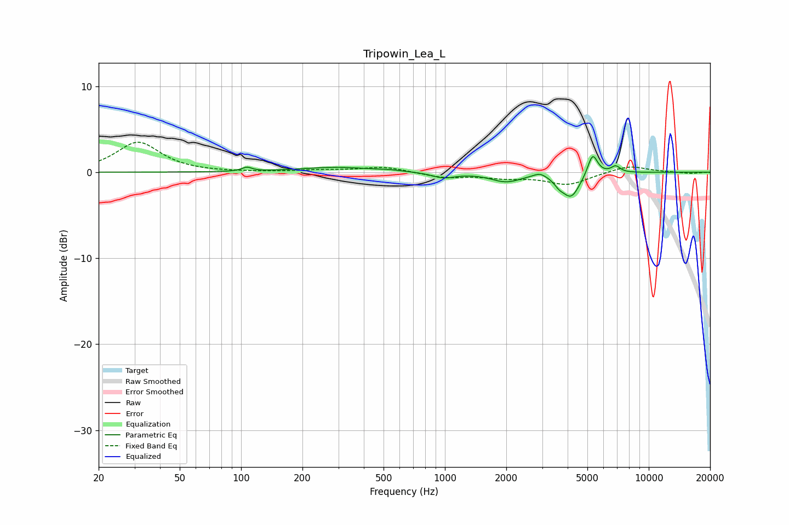

# Tripowin_Lea_L
See [usage instructions](https://github.com/jaakkopasanen/AutoEq#usage) for more options and info.

### Parametric EQs
Apply preamp of -1.9 dB when using parametric equalizer.

|   # | Type    |   Fc (Hz) |    Q |   Gain (dB) |
|-----|---------|-----------|------|-------------|
|   1 | Peaking |       107 | 6    |         0.5 |
|   2 | Peaking |       292 | 0.82 |         0.6 |
|   3 | Peaking |       534 | 2.61 |         0.1 |
|   4 | Peaking |       983 | 2.48 |        -0.6 |
|   5 | Peaking |      1993 | 1.91 |        -1   |
|   6 | Peaking |      2922 | 4.49 |         0.5 |
|   7 | Peaking |      3632 | 6    |        -0.6 |
|   8 | Peaking |      4159 | 3.2  |        -2.8 |
|   9 | Peaking |      5305 | 5.8  |         2.5 |
|  10 | Peaking |      6881 | 6    |         0.8 |

### Fixed Band EQs
When using fixed band (also called graphic) equalizer, apply preamp of **-3.6 dB** (if available) and set gains manually with these parameters.

|   # | Type    |   Fc (Hz) |    Q |   Gain (dB) |
|-----|---------|-----------|------|-------------|
|   1 | Peaking |        31 | 1.41 |         3.5 |
|   2 | Peaking |        62 | 1.41 |        -0   |
|   3 | Peaking |       125 | 1.41 |        -0   |
|   4 | Peaking |       250 | 1.41 |         0.2 |
|   5 | Peaking |       500 | 1.41 |         0.6 |
|   6 | Peaking |      1000 | 1.41 |        -0.6 |
|   7 | Peaking |      2000 | 1.41 |        -0.5 |
|   8 | Peaking |      4000 | 1.41 |        -1.4 |
|   9 | Peaking |      8000 | 1.41 |         0.8 |
|  10 | Peaking |     16000 | 1.41 |        -0.2 |

### Graphs

