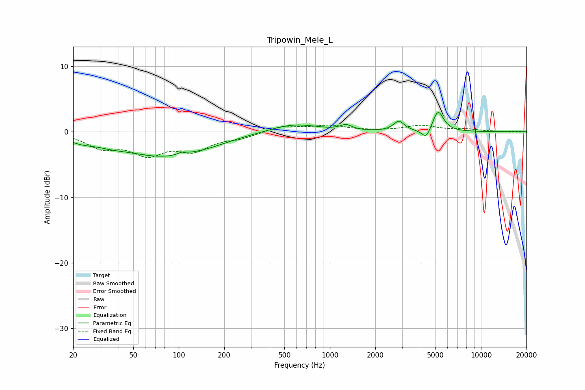

# Tripowin_Mele_L
See [usage instructions](https://github.com/jaakkopasanen/AutoEq#usage) for more options and info.

### Parametric EQs
Apply preamp of -3.0 dB when using parametric equalizer.

|   # | Type    |   Fc (Hz) |    Q |   Gain (dB) |
|-----|---------|-----------|------|-------------|
|   1 | Peaking |        23 | 1.68 |        -0.8 |
|   2 | Peaking |        35 | 1.49 |        -0.5 |
|   3 | Peaking |        80 | 0.5  |        -3.6 |
|   4 | Peaking |       105 | 5.11 |         0.4 |
|   5 | Peaking |       167 | 1.22 |        -0.3 |
|   6 | Peaking |       577 | 0.91 |         1.3 |
|   7 | Peaking |      1280 | 3.8  |         0.8 |
|   8 | Peaking |      2862 | 4.13 |         1.5 |
|   9 | Peaking |      4349 | 4.57 |        -1.7 |
|  10 | Peaking |      5191 | 3.77 |         3.3 |

### Fixed Band EQs
When using fixed band (also called graphic) equalizer, apply preamp of **-1.1 dB** (if available) and set gains manually with these parameters.

|   # | Type    |   Fc (Hz) |    Q |   Gain (dB) |
|-----|---------|-----------|------|-------------|
|   1 | Peaking |        31 | 1.41 |        -2.2 |
|   2 | Peaking |        62 | 1.41 |        -3.1 |
|   3 | Peaking |       125 | 1.41 |        -2.5 |
|   4 | Peaking |       250 | 1.41 |        -0.8 |
|   5 | Peaking |       500 | 1.41 |         0.9 |
|   6 | Peaking |      1000 | 1.41 |         0.9 |
|   7 | Peaking |      2000 | 1.41 |         0.1 |
|   8 | Peaking |      4000 | 1.41 |         0.9 |
|   9 | Peaking |      8000 | 1.41 |         0.3 |
|  10 | Peaking |     16000 | 1.41 |         0   |

### Graphs

