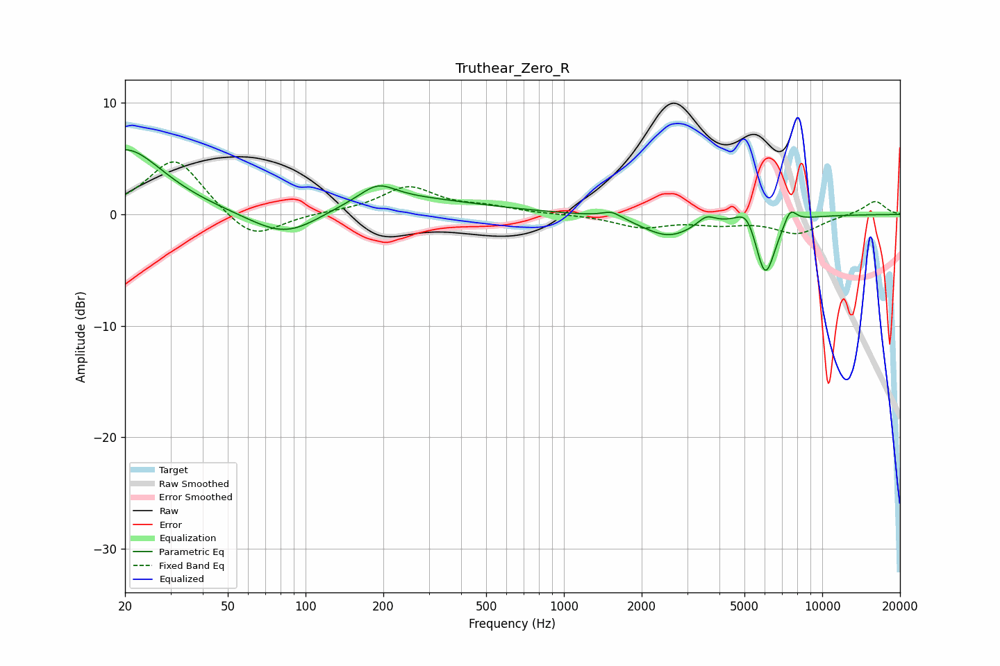

# Truthear_Zero_R
See [usage instructions](https://github.com/jaakkopasanen/AutoEq#usage) for more options and info.

### Parametric EQs
Apply preamp of -5.9 dB when using parametric equalizer.

|   # | Type    |   Fc (Hz) |    Q |   Gain (dB) |
|-----|---------|-----------|------|-------------|
|   1 | Peaking |        20 | 0.96 |         5.9 |
|   2 | Peaking |        84 | 0.96 |        -3.1 |
|   3 | Peaking |       179 | 0.4  |         1.8 |
|   4 | Peaking |       190 | 2.12 |         1.4 |
|   5 | Peaking |      1534 | 3.67 |         0.6 |
|   6 | Peaking |      2542 | 1.4  |        -1.9 |
|   7 | Peaking |      3560 | 4.27 |         0.8 |
|   8 | Peaking |      5125 | 3.47 |         1.8 |
|   9 | Peaking |      6012 | 3.44 |        -5.7 |
|  10 | Peaking |      7519 | 5.42 |         1.4 |

### Fixed Band EQs
When using fixed band (also called graphic) equalizer, apply preamp of **-4.8 dB** (if available) and set gains manually with these parameters.

|   # | Type    |   Fc (Hz) |    Q |   Gain (dB) |
|-----|---------|-----------|------|-------------|
|   1 | Peaking |        31 | 1.41 |         5.1 |
|   2 | Peaking |        62 | 1.41 |        -2.5 |
|   3 | Peaking |       125 | 1.41 |         0.1 |
|   4 | Peaking |       250 | 1.41 |         2.4 |
|   5 | Peaking |       500 | 1.41 |         0.6 |
|   6 | Peaking |      1000 | 1.41 |         0   |
|   7 | Peaking |      2000 | 1.41 |        -1.1 |
|   8 | Peaking |      4000 | 1.41 |        -0.7 |
|   9 | Peaking |      8000 | 1.41 |        -1.6 |
|  10 | Peaking |     16000 | 1.41 |         1.3 |

### Graphs

