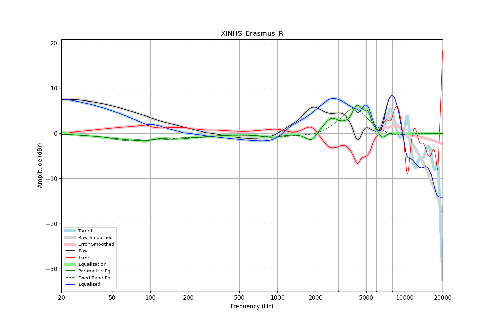

# XINHS_Erasmus_R
See [usage instructions](https://github.com/jaakkopasanen/AutoEq#usage) for more options and info.

### Parametric EQs
Apply preamp of -6.3 dB when using parametric equalizer.

|   # | Type    |   Fc (Hz) |    Q |   Gain (dB) |
|-----|---------|-----------|------|-------------|
|   1 | Peaking |       103 | 0.54 |        -1.9 |
|   2 | Peaking |       121 | 2.83 |         0.7 |
|   3 | Peaking |       900 | 1.74 |        -0.8 |
|   4 | Peaking |      1853 | 3.28 |        -2.2 |
|   5 | Peaking |      2409 | 2.73 |         0.9 |
|   6 | Peaking |      2697 | 2.82 |         2.3 |
|   7 | Peaking |      3698 | 5.93 |        -0.7 |
|   8 | Peaking |      4247 | 2.67 |         5.8 |
|   9 | Peaking |      5158 | 5.95 |         2.5 |
|  10 | Peaking |      6655 | 4.17 |        -1.7 |

### Fixed Band EQs
When using fixed band (also called graphic) equalizer, apply preamp of **-5.6 dB** (if available) and set gains manually with these parameters.

|   # | Type    |   Fc (Hz) |    Q |   Gain (dB) |
|-----|---------|-----------|------|-------------|
|   1 | Peaking |        31 | 1.41 |        -0.2 |
|   2 | Peaking |        62 | 1.41 |        -1.3 |
|   3 | Peaking |       125 | 1.41 |        -1.1 |
|   4 | Peaking |       250 | 1.41 |        -0.6 |
|   5 | Peaking |       500 | 1.41 |        -0.1 |
|   6 | Peaking |      1000 | 1.41 |        -0.8 |
|   7 | Peaking |      2000 | 1.41 |        -0.8 |
|   8 | Peaking |      4000 | 1.41 |         5.8 |
|   9 | Peaking |      8000 | 1.41 |        -1   |
|  10 | Peaking |     16000 | 1.41 |        -0.1 |

### Graphs

