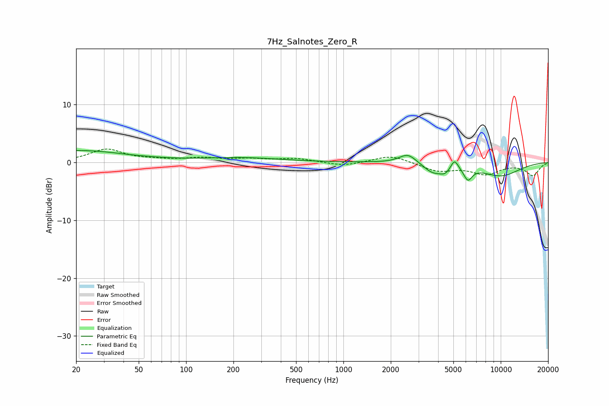

# 7Hz_Salnotes_Zero_R
See [usage instructions](https://github.com/jaakkopasanen/AutoEq#usage) for more options and info.

### Parametric EQs
Apply preamp of -2.1 dB when using parametric equalizer.

|   # | Type    |   Fc (Hz) |    Q |   Gain (dB) |
|-----|---------|-----------|------|-------------|
|   1 | Peaking |        20 | 0.44 |         2   |
|   2 | Peaking |        42 | 3.42 |        -0   |
|   3 | Peaking |       227 | 0.58 |         0.7 |
|   4 | Peaking |      2569 | 2.84 |        -0.1 |
|   5 | Peaking |      2569 | 2.6  |         1.8 |
|   6 | Peaking |      3689 | 2.37 |        -1.6 |
|   7 | Peaking |      4421 | 4    |        -1.1 |
|   8 | Peaking |      5083 | 6    |         1.7 |
|   9 | Peaking |      6186 | 5.08 |        -2.2 |
|  10 | Peaking |     10000 | 0.96 |        -2.3 |

### Fixed Band EQs
When using fixed band (also called graphic) equalizer, apply preamp of **-2.4 dB** (if available) and set gains manually with these parameters.

|   # | Type    |   Fc (Hz) |    Q |   Gain (dB) |
|-----|---------|-----------|------|-------------|
|   1 | Peaking |        31 | 1.41 |         2.2 |
|   2 | Peaking |        62 | 1.41 |         0.3 |
|   3 | Peaking |       125 | 1.41 |         0.7 |
|   4 | Peaking |       250 | 1.41 |         0.5 |
|   5 | Peaking |       500 | 1.41 |         0.6 |
|   6 | Peaking |      1000 | 1.41 |        -0.7 |
|   7 | Peaking |      2000 | 1.41 |         1.3 |
|   8 | Peaking |      4000 | 1.41 |        -1.4 |
|   9 | Peaking |      8000 | 1.41 |        -1.9 |
|  10 | Peaking |     16000 | 1.41 |        -2.2 |

### Graphs

