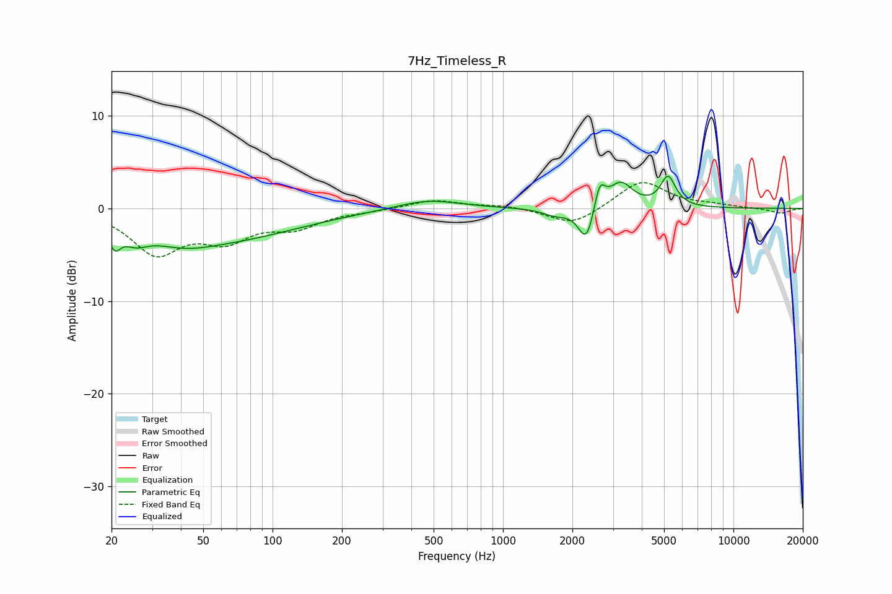

# 7Hz_Timeless_R
See [usage instructions](https://github.com/jaakkopasanen/AutoEq#usage) for more options and info.

### Parametric EQs
Apply preamp of -3.6 dB when using parametric equalizer.

|   # | Type    |   Fc (Hz) |    Q |   Gain (dB) |
|-----|---------|-----------|------|-------------|
|   1 | Peaking |        21 | 5.63 |        -2.1 |
|   2 | Peaking |        25 | 2.54 |        -1.5 |
|   3 | Peaking |        40 | 1.03 |        -1.5 |
|   4 | Peaking |        63 | 0.44 |        -3   |
|   5 | Peaking |       471 | 1.04 |         1   |
|   6 | Peaking |      1685 | 2.52 |        -0.7 |
|   7 | Peaking |      2304 | 4.11 |        -4   |
|   8 | Peaking |      2626 | 5.98 |         3   |
|   9 | Peaking |      3242 | 2.72 |         2.8 |
|  10 | Peaking |      5204 | 4.32 |         3.2 |

### Fixed Band EQs
When using fixed band (also called graphic) equalizer, apply preamp of **-2.9 dB** (if available) and set gains manually with these parameters.

|   # | Type    |   Fc (Hz) |    Q |   Gain (dB) |
|-----|---------|-----------|------|-------------|
|   1 | Peaking |        31 | 1.41 |        -4.6 |
|   2 | Peaking |        62 | 1.41 |        -2.9 |
|   3 | Peaking |       125 | 1.41 |        -1.8 |
|   4 | Peaking |       250 | 1.41 |        -0.2 |
|   5 | Peaking |       500 | 1.41 |         0.9 |
|   6 | Peaking |      1000 | 1.41 |         0.3 |
|   7 | Peaking |      2000 | 1.41 |        -1.9 |
|   8 | Peaking |      4000 | 1.41 |         3   |
|   9 | Peaking |      8000 | 1.41 |         0.3 |
|  10 | Peaking |     16000 | 1.41 |        -0.5 |

### Graphs

