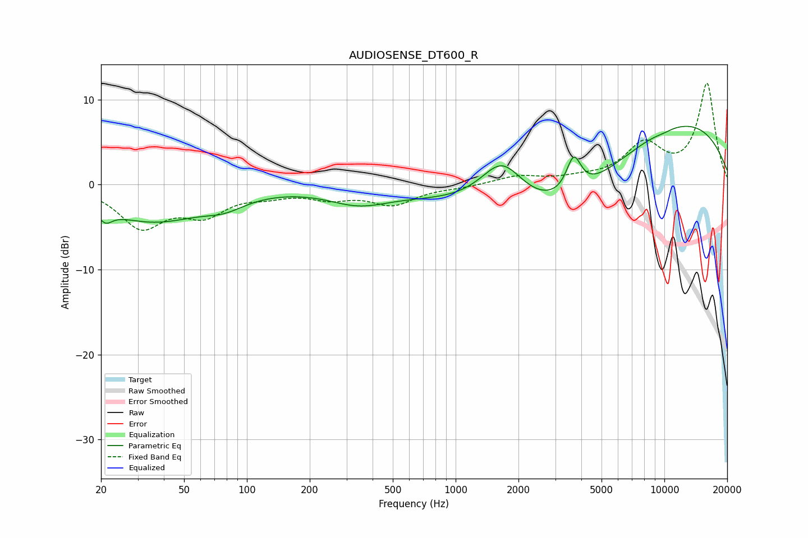

# AUDIOSENSE_DT600_R
See [usage instructions](https://github.com/jaakkopasanen/AutoEq#usage) for more options and info.

### Parametric EQs
Apply preamp of -6.9 dB when using parametric equalizer.

|   # | Type    |   Fc (Hz) |    Q |   Gain (dB) |
|-----|---------|-----------|------|-------------|
|   1 | Peaking |        21 | 4.3  |        -1.5 |
|   2 | Peaking |        35 | 0.57 |        -4.2 |
|   3 | Peaking |        78 | 1.45 |        -1.2 |
|   4 | Peaking |       341 | 0.98 |        -1.8 |
|   5 | Peaking |      1668 | 1.35 |         5.4 |
|   6 | Peaking |      2611 | 0.21 |        -2   |
|   7 | Peaking |      3388 | 0.48 |        -5.5 |
|   8 | Peaking |      3678 | 3.97 |         4.2 |
|   9 | Peaking |      9731 | 0.27 |         8.9 |
|  10 | Peaking |      9930 | 3.27 |        -0.2 |

### Fixed Band EQs
When using fixed band (also called graphic) equalizer, apply preamp of **-12.0 dB** (if available) and set gains manually with these parameters.

|   # | Type    |   Fc (Hz) |    Q |   Gain (dB) |
|-----|---------|-----------|------|-------------|
|   1 | Peaking |        31 | 1.41 |        -4.8 |
|   2 | Peaking |        62 | 1.41 |        -3.1 |
|   3 | Peaking |       125 | 1.41 |        -0.9 |
|   4 | Peaking |       250 | 1.41 |        -1.3 |
|   5 | Peaking |       500 | 1.41 |        -2.2 |
|   6 | Peaking |      1000 | 1.41 |        -0.3 |
|   7 | Peaking |      2000 | 1.41 |         0.9 |
|   8 | Peaking |      4000 | 1.41 |         0.5 |
|   9 | Peaking |      8000 | 1.41 |         4.4 |
|  10 | Peaking |     16000 | 1.41 |        11.8 |

### Graphs

