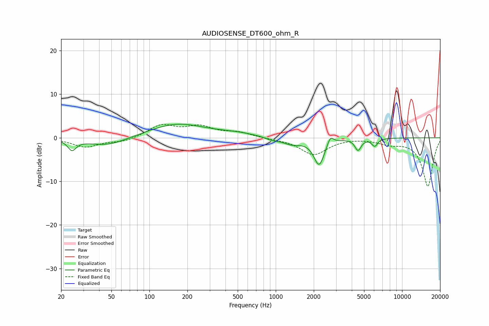

# AUDIOSENSE_DT600_ohm_R
See [usage instructions](https://github.com/jaakkopasanen/AutoEq#usage) for more options and info.

### Parametric EQs
Apply preamp of -3.2 dB when using parametric equalizer.

|   # | Type    |   Fc (Hz) |    Q |   Gain (dB) |
|-----|---------|-----------|------|-------------|
|   1 | Peaking |        24 | 4.42 |        -2.3 |
|   2 | Peaking |        46 | 0.88 |        -2   |
|   3 | Peaking |       165 | 0.63 |         3.2 |
|   4 | Peaking |       492 | 0.93 |         0.7 |
|   5 | Peaking |       933 | 2.74 |        -0.6 |
|   6 | Peaking |      1342 | 1.95 |        -1.4 |
|   7 | Peaking |      2206 | 3.35 |        -6.1 |
|   8 | Peaking |      2703 | 5.88 |         2   |
|   9 | Peaking |      4482 | 5.8  |        -2.6 |
|  10 | Peaking |      6075 | 5.99 |        -1.7 |

### Fixed Band EQs
When using fixed band (also called graphic) equalizer, apply preamp of **-3.2 dB** (if available) and set gains manually with these parameters.

|   # | Type    |   Fc (Hz) |    Q |   Gain (dB) |
|-----|---------|-----------|------|-------------|
|   1 | Peaking |        31 | 1.41 |        -2.1 |
|   2 | Peaking |        62 | 1.41 |        -0.9 |
|   3 | Peaking |       125 | 1.41 |         2.8 |
|   4 | Peaking |       250 | 1.41 |         2.3 |
|   5 | Peaking |       500 | 1.41 |         1.1 |
|   6 | Peaking |      1000 | 1.41 |        -0.2 |
|   7 | Peaking |      2000 | 1.41 |        -3.8 |
|   8 | Peaking |      4000 | 1.41 |         0.1 |
|   9 | Peaking |      8000 | 1.41 |        -1.1 |
|  10 | Peaking |     16000 | 1.41 |       -11.1 |

### Graphs

