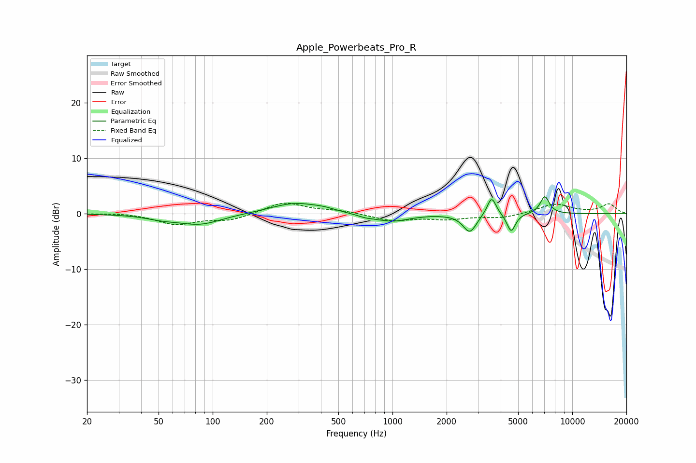

# Apple_Powerbeats_Pro_R
See [usage instructions](https://github.com/jaakkopasanen/AutoEq#usage) for more options and info.

### Parametric EQs
Apply preamp of -3.2 dB when using parametric equalizer.

|   # | Type    |   Fc (Hz) |    Q |   Gain (dB) |
|-----|---------|-----------|------|-------------|
|   1 | Peaking |        52 | 1.56 |        -0.6 |
|   2 | Peaking |        85 | 1.17 |        -1.9 |
|   3 | Peaking |       287 | 1.04 |         2   |
|   4 | Peaking |       415 | 2.53 |         0.3 |
|   5 | Peaking |       708 | 2.79 |        -0.4 |
|   6 | Peaking |       995 | 1.48 |        -1.4 |
|   7 | Peaking |      2691 | 3.84 |        -3.3 |
|   8 | Peaking |      3561 | 5.64 |         3.4 |
|   9 | Peaking |      4573 | 6    |        -3.3 |
|  10 | Peaking |      7033 | 5.32 |         3.2 |

### Fixed Band EQs
When using fixed band (also called graphic) equalizer, apply preamp of **-2.0 dB** (if available) and set gains manually with these parameters.

|   # | Type    |   Fc (Hz) |    Q |   Gain (dB) |
|-----|---------|-----------|------|-------------|
|   1 | Peaking |        31 | 1.41 |         0.2 |
|   2 | Peaking |        62 | 1.41 |        -1.9 |
|   3 | Peaking |       125 | 1.41 |        -1.1 |
|   4 | Peaking |       250 | 1.41 |         2.1 |
|   5 | Peaking |       500 | 1.41 |         0.5 |
|   6 | Peaking |      1000 | 1.41 |        -1.2 |
|   7 | Peaking |      2000 | 1.41 |        -0.9 |
|   8 | Peaking |      4000 | 1.41 |        -0.8 |
|   9 | Peaking |      8000 | 1.41 |         1.7 |
|  10 | Peaking |     16000 | 1.41 |         1.7 |

### Graphs

