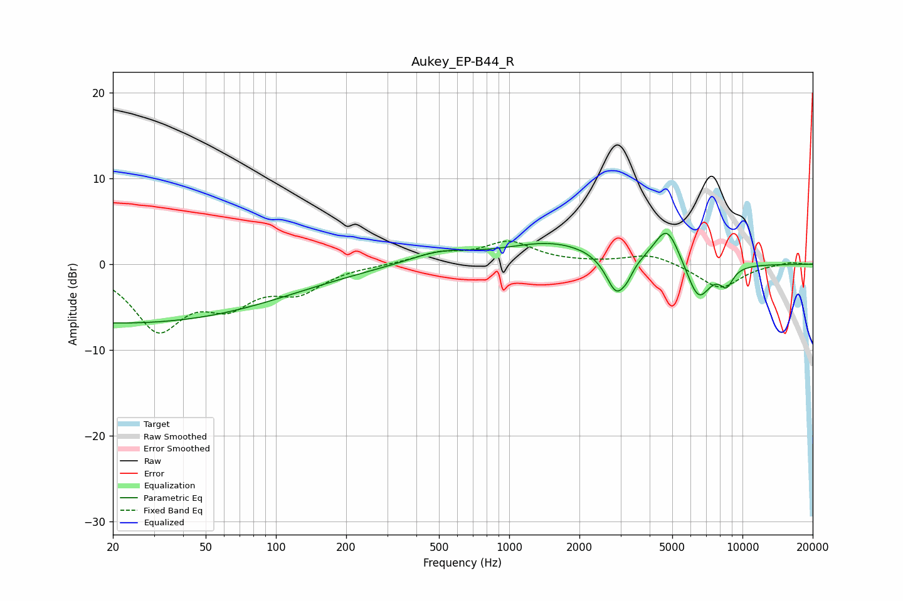

# Aukey_EP-B44_R
See [usage instructions](https://github.com/jaakkopasanen/AutoEq#usage) for more options and info.

### Parametric EQs
Apply preamp of -3.7 dB when using parametric equalizer.

|   # | Type    |   Fc (Hz) |    Q |   Gain (dB) |
|-----|---------|-----------|------|-------------|
|   1 | Peaking |        22 | 0.18 |        -6.8 |
|   2 | Peaking |       502 | 1.04 |         1.3 |
|   3 | Peaking |      1541 | 0.68 |         2.5 |
|   4 | Peaking |      2883 | 3.16 |        -4.6 |
|   5 | Peaking |      3220 | 6    |        -0.8 |
|   6 | Peaking |      4747 | 2.56 |         4.5 |
|   7 | Peaking |      6169 | 2.21 |         0.2 |
|   8 | Peaking |      6443 | 2.59 |        -4.2 |
|   9 | Peaking |      6595 | 3.26 |        -0.5 |
|  10 | Peaking |      8543 | 4.41 |        -2.1 |

### Fixed Band EQs
When using fixed band (also called graphic) equalizer, apply preamp of **-2.8 dB** (if available) and set gains manually with these parameters.

|   # | Type    |   Fc (Hz) |    Q |   Gain (dB) |
|-----|---------|-----------|------|-------------|
|   1 | Peaking |        31 | 1.41 |        -7.2 |
|   2 | Peaking |        62 | 1.41 |        -3.9 |
|   3 | Peaking |       125 | 1.41 |        -2.8 |
|   4 | Peaking |       250 | 1.41 |        -0.1 |
|   5 | Peaking |       500 | 1.41 |         1.2 |
|   6 | Peaking |      1000 | 1.41 |         2.5 |
|   7 | Peaking |      2000 | 1.41 |         0.1 |
|   8 | Peaking |      4000 | 1.41 |         1.2 |
|   9 | Peaking |      8000 | 1.41 |        -2.9 |
|  10 | Peaking |     16000 | 1.41 |         0.3 |

### Graphs

