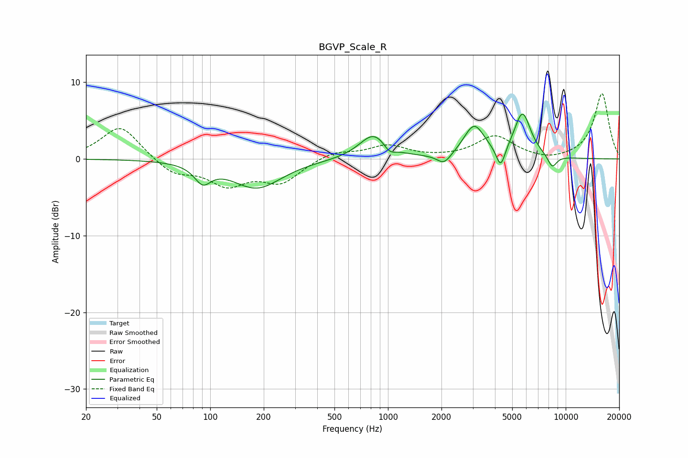

# BGVP_Scale_R
See [usage instructions](https://github.com/jaakkopasanen/AutoEq#usage) for more options and info.

### Parametric EQs
Apply preamp of -5.9 dB when using parametric equalizer.

|   # | Type    |   Fc (Hz) |    Q |   Gain (dB) |
|-----|---------|-----------|------|-------------|
|   1 | Peaking |        91 | 3.1  |        -2.3 |
|   2 | Peaking |       183 | 1.01 |        -3.8 |
|   3 | Peaking |       829 | 1.74 |         3   |
|   4 | Peaking |       850 | 2.31 |         0.3 |
|   5 | Peaking |      1018 | 4.28 |        -1   |
|   6 | Peaking |      2071 | 3.54 |        -1.4 |
|   7 | Peaking |      3054 | 2.42 |         4.2 |
|   8 | Peaking |      4307 | 5.59 |        -2.9 |
|   9 | Peaking |      5713 | 2.96 |         5.8 |
|  10 | Peaking |      8397 | 4.96 |        -1.7 |

### Fixed Band EQs
When using fixed band (also called graphic) equalizer, apply preamp of **-8.6 dB** (if available) and set gains manually with these parameters.

|   # | Type    |   Fc (Hz) |    Q |   Gain (dB) |
|-----|---------|-----------|------|-------------|
|   1 | Peaking |        31 | 1.41 |         4.4 |
|   2 | Peaking |        62 | 1.41 |        -2   |
|   3 | Peaking |       125 | 1.41 |        -3.1 |
|   4 | Peaking |       250 | 1.41 |        -2.9 |
|   5 | Peaking |       500 | 1.41 |         1   |
|   6 | Peaking |      1000 | 1.41 |         1.7 |
|   7 | Peaking |      2000 | 1.41 |         0   |
|   8 | Peaking |      4000 | 1.41 |         2.9 |
|   9 | Peaking |      8000 | 1.41 |        -0.4 |
|  10 | Peaking |     16000 | 1.41 |         8.6 |

### Graphs

