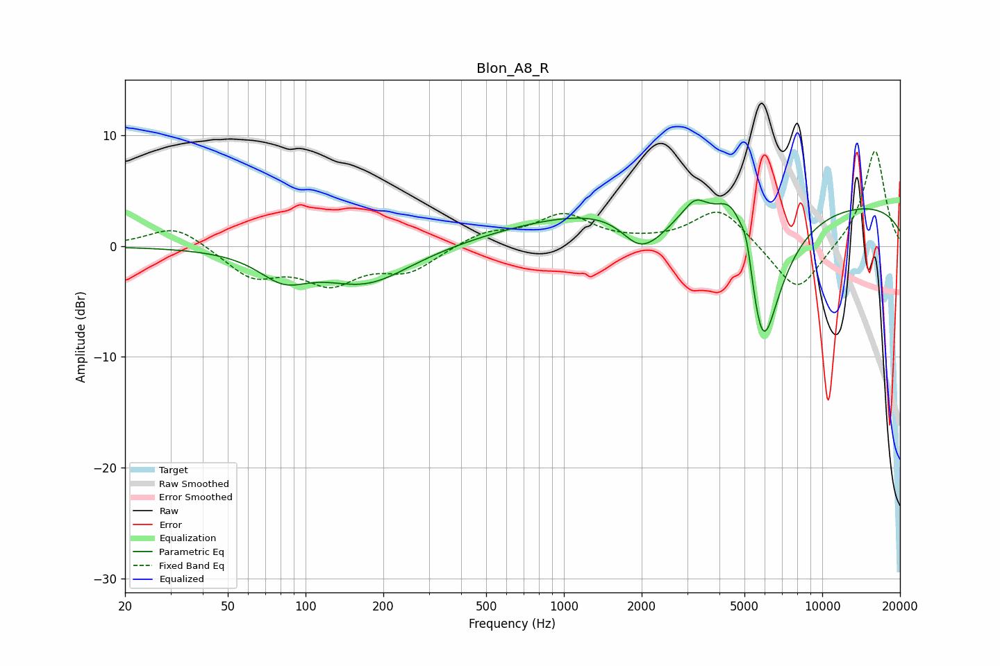

# Blon_A8_R
See [usage instructions](https://github.com/jaakkopasanen/AutoEq#usage) for more options and info.

### Parametric EQs
Apply preamp of -4.3 dB when using parametric equalizer.

|   # | Type    |   Fc (Hz) |    Q |   Gain (dB) |
|-----|---------|-----------|------|-------------|
|   1 | Peaking |        82 | 1.49 |        -2.3 |
|   2 | Peaking |       171 | 0.82 |        -3.3 |
|   3 | Peaking |      1280 | 0.38 |         2.5 |
|   4 | Peaking |      1936 | 2.02 |        -2.4 |
|   5 | Peaking |      2275 | 1.89 |        -1.4 |
|   6 | Peaking |      3225 | 3.15 |         1.7 |
|   7 | Peaking |      4538 | 2.11 |         5.2 |
|   8 | Peaking |      5105 | 5.98 |         2.6 |
|   9 | Peaking |      5862 | 1.81 |       -14.6 |
|  10 | Peaking |     10000 | 0.18 |         4.1 |

### Fixed Band EQs
When using fixed band (also called graphic) equalizer, apply preamp of **-8.7 dB** (if available) and set gains manually with these parameters.

|   # | Type    |   Fc (Hz) |    Q |   Gain (dB) |
|-----|---------|-----------|------|-------------|
|   1 | Peaking |        31 | 1.41 |         2   |
|   2 | Peaking |        62 | 1.41 |        -2.7 |
|   3 | Peaking |       125 | 1.41 |        -3   |
|   4 | Peaking |       250 | 1.41 |        -2.1 |
|   5 | Peaking |       500 | 1.41 |         1.2 |
|   6 | Peaking |      1000 | 1.41 |         2.7 |
|   7 | Peaking |      2000 | 1.41 |         0.2 |
|   8 | Peaking |      4000 | 1.41 |         3.5 |
|   9 | Peaking |      8000 | 1.41 |        -4.5 |
|  10 | Peaking |     16000 | 1.41 |         8.8 |

### Graphs

