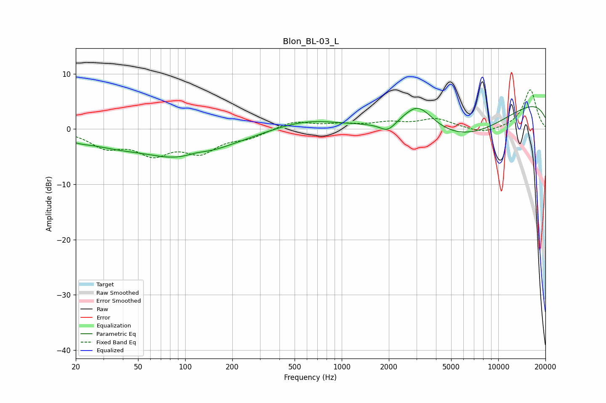

# Blon_BL-03_L
See [usage instructions](https://github.com/jaakkopasanen/AutoEq#usage) for more options and info.

### Parametric EQs
Apply preamp of -4.2 dB when using parametric equalizer.

|   # | Type    |   Fc (Hz) |    Q |   Gain (dB) |
|-----|---------|-----------|------|-------------|
|   1 | Peaking |        21 | 1.56 |        -0.9 |
|   2 | Peaking |        35 | 0.81 |        -1.3 |
|   3 | Peaking |        56 | 1.07 |         0.3 |
|   4 | Peaking |        95 | 0.49 |        -5.2 |
|   5 | Peaking |       117 | 1.95 |         0.7 |
|   6 | Peaking |       593 | 0.69 |         1.7 |
|   7 | Peaking |      1969 | 2.83 |        -1.7 |
|   8 | Peaking |      3067 | 1.46 |         4.7 |
|   9 | Peaking |      5844 | 0.4  |        -7.8 |
|  10 | Peaking |      9719 | 0.18 |         6.8 |

### Fixed Band EQs
When using fixed band (also called graphic) equalizer, apply preamp of **-7.2 dB** (if available) and set gains manually with these parameters.

|   # | Type    |   Fc (Hz) |    Q |   Gain (dB) |
|-----|---------|-----------|------|-------------|
|   1 | Peaking |        31 | 1.41 |        -2.9 |
|   2 | Peaking |        62 | 1.41 |        -3.9 |
|   3 | Peaking |       125 | 1.41 |        -3.7 |
|   4 | Peaking |       250 | 1.41 |        -1.3 |
|   5 | Peaking |       500 | 1.41 |         1.4 |
|   6 | Peaking |      1000 | 1.41 |         0.7 |
|   7 | Peaking |      2000 | 1.41 |         1   |
|   8 | Peaking |      4000 | 1.41 |         1.8 |
|   9 | Peaking |      8000 | 1.41 |        -0.9 |
|  10 | Peaking |     16000 | 1.41 |         7.2 |

### Graphs

