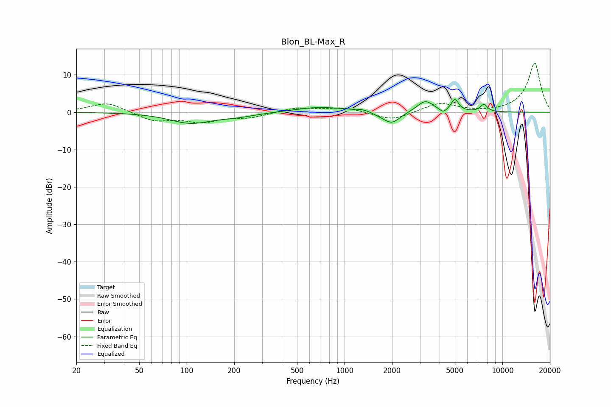

# Blon_BL-Max_R
See [usage instructions](https://github.com/jaakkopasanen/AutoEq#usage) for more options and info.

### Parametric EQs
Apply preamp of -3.5 dB when using parametric equalizer.

|   # | Type    |   Fc (Hz) |    Q |   Gain (dB) |
|-----|---------|-----------|------|-------------|
|   1 | Peaking |       106 | 1.07 |        -2.8 |
|   2 | Peaking |       208 | 1.18 |        -0.9 |
|   3 | Peaking |       699 | 0.91 |         1.4 |
|   4 | Peaking |      1306 | 2.95 |         0.6 |
|   5 | Peaking |      1718 | 2.38 |        -0.6 |
|   6 | Peaking |      2002 | 2.71 |        -2.9 |
|   7 | Peaking |      3251 | 2.73 |         3.1 |
|   8 | Peaking |      4214 | 6    |        -1.1 |
|   9 | Peaking |      4997 | 5.98 |         3.2 |
|  10 | Peaking |      7632 | 5.96 |         2   |

### Fixed Band EQs
When using fixed band (also called graphic) equalizer, apply preamp of **-13.3 dB** (if available) and set gains manually with these parameters.

|   # | Type    |   Fc (Hz) |    Q |   Gain (dB) |
|-----|---------|-----------|------|-------------|
|   1 | Peaking |        31 | 1.41 |         2.7 |
|   2 | Peaking |        62 | 1.41 |        -2.3 |
|   3 | Peaking |       125 | 1.41 |        -2.4 |
|   4 | Peaking |       250 | 1.41 |        -1.3 |
|   5 | Peaking |       500 | 1.41 |         1.2 |
|   6 | Peaking |      1000 | 1.41 |         1.2 |
|   7 | Peaking |      2000 | 1.41 |        -2.3 |
|   8 | Peaking |      4000 | 1.41 |         2.5 |
|   9 | Peaking |      8000 | 1.41 |        -0.1 |
|  10 | Peaking |     16000 | 1.41 |        13.3 |

### Graphs

