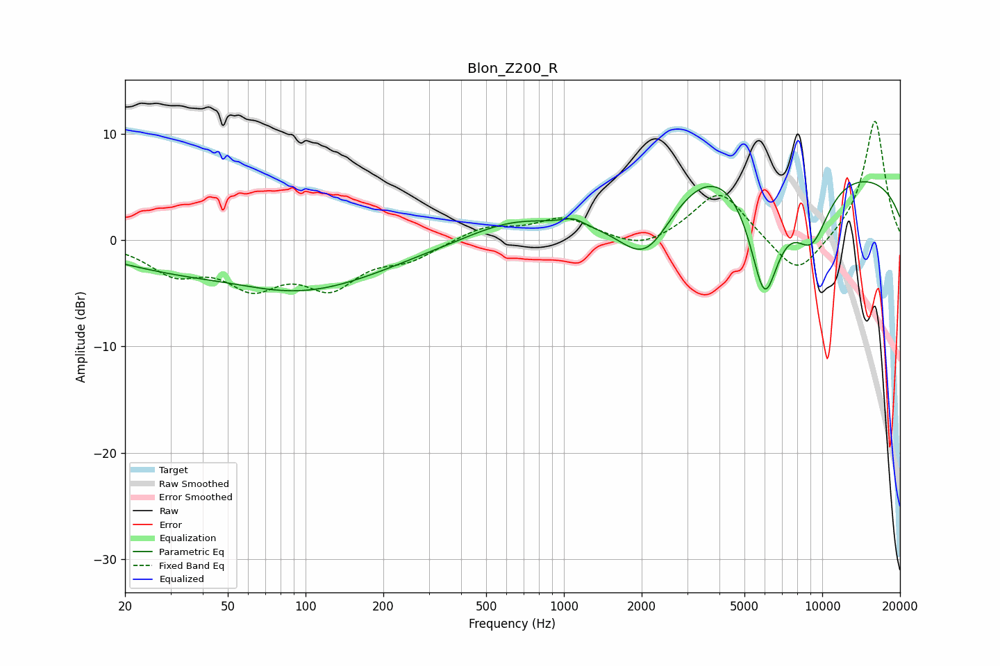

# Blon_Z200_R
See [usage instructions](https://github.com/jaakkopasanen/AutoEq#usage) for more options and info.

### Parametric EQs
Apply preamp of -5.6 dB when using parametric equalizer.

|   # | Type    |   Fc (Hz) |    Q |   Gain (dB) |
|-----|---------|-----------|------|-------------|
|   1 | Peaking |        52 | 0.58 |         2.7 |
|   2 | Peaking |        52 | 0.38 |        -1.4 |
|   3 | Peaking |        70 | 0.36 |        -5.7 |
|   4 | Peaking |       630 | 0.78 |         1.8 |
|   5 | Peaking |      1088 | 3.37 |         0.6 |
|   6 | Peaking |      2080 | 1.27 |        -6.2 |
|   7 | Peaking |      4212 | 0.55 |         5   |
|   8 | Peaking |      5975 | 1.99 |       -12.8 |
|   9 | Peaking |      9082 | 1.71 |        -6.1 |
|  10 | Peaking |     10000 | 0.19 |         6.4 |

### Fixed Band EQs
When using fixed band (also called graphic) equalizer, apply preamp of **-11.3 dB** (if available) and set gains manually with these parameters.

|   # | Type    |   Fc (Hz) |    Q |   Gain (dB) |
|-----|---------|-----------|------|-------------|
|   1 | Peaking |        31 | 1.41 |        -2.7 |
|   2 | Peaking |        62 | 1.41 |        -3.7 |
|   3 | Peaking |       125 | 1.41 |        -3.9 |
|   4 | Peaking |       250 | 1.41 |        -1.5 |
|   5 | Peaking |       500 | 1.41 |         1.3 |
|   6 | Peaking |      1000 | 1.41 |         2   |
|   7 | Peaking |      2000 | 1.41 |        -1.1 |
|   8 | Peaking |      4000 | 1.41 |         4.8 |
|   9 | Peaking |      8000 | 1.41 |        -3.7 |
|  10 | Peaking |     16000 | 1.41 |        11.4 |

### Graphs

