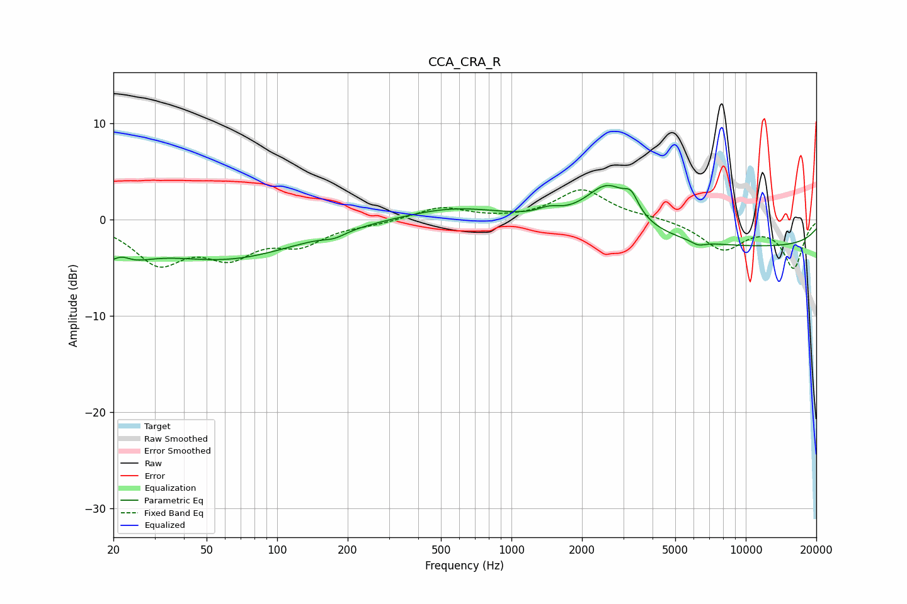

# CCA_CRA_R
See [usage instructions](https://github.com/jaakkopasanen/AutoEq#usage) for more options and info.

### Parametric EQs
Apply preamp of -3.7 dB when using parametric equalizer.

|   # | Type    |   Fc (Hz) |    Q |   Gain (dB) |
|-----|---------|-----------|------|-------------|
|   1 | Peaking |        20 | 1.35 |        -4   |
|   2 | Peaking |        21 | 3.18 |         1.6 |
|   3 | Peaking |        61 | 0.46 |        -3.9 |
|   4 | Peaking |       176 | 2.95 |        -0.5 |
|   5 | Peaking |       572 | 0.67 |         1.4 |
|   6 | Peaking |      1449 | 2.91 |         0.7 |
|   7 | Peaking |      2585 | 1.45 |         4.8 |
|   8 | Peaking |      3245 | 4.71 |         1.7 |
|   9 | Peaking |      6264 | 4.6  |        -0.5 |
|  10 | Peaking |     10000 | 0.18 |        -2.8 |

### Fixed Band EQs
When using fixed band (also called graphic) equalizer, apply preamp of **-3.2 dB** (if available) and set gains manually with these parameters.

|   # | Type    |   Fc (Hz) |    Q |   Gain (dB) |
|-----|---------|-----------|------|-------------|
|   1 | Peaking |        31 | 1.41 |        -4.2 |
|   2 | Peaking |        62 | 1.41 |        -3.2 |
|   3 | Peaking |       125 | 1.41 |        -2.2 |
|   4 | Peaking |       250 | 1.41 |        -0.3 |
|   5 | Peaking |       500 | 1.41 |         1.3 |
|   6 | Peaking |      1000 | 1.41 |        -0   |
|   7 | Peaking |      2000 | 1.41 |         3.1 |
|   8 | Peaking |      4000 | 1.41 |         0.2 |
|   9 | Peaking |      8000 | 1.41 |        -3   |
|  10 | Peaking |     16000 | 1.41 |        -4.9 |

### Graphs

