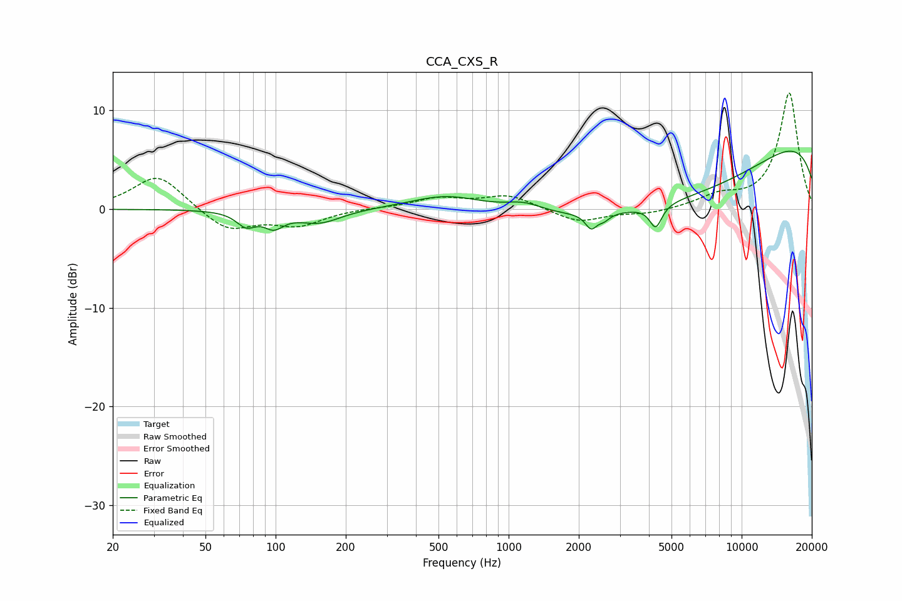

# CCA_CXS_R
See [usage instructions](https://github.com/jaakkopasanen/AutoEq#usage) for more options and info.

### Parametric EQs
Apply preamp of -6.0 dB when using parametric equalizer.

|   # | Type    |   Fc (Hz) |    Q |   Gain (dB) |
|-----|---------|-----------|------|-------------|
|   1 | Peaking |        75 | 3.47 |        -1.4 |
|   2 | Peaking |        98 | 3.37 |        -1.4 |
|   3 | Peaking |       154 | 1.5  |        -1.4 |
|   4 | Peaking |       544 | 0.91 |         1.5 |
|   5 | Peaking |      1160 | 1.81 |         0.9 |
|   6 | Peaking |      2260 | 5.77 |        -1.5 |
|   7 | Peaking |      2566 | 5.93 |        -0.6 |
|   8 | Peaking |      4279 | 5.42 |        -2.3 |
|   9 | Peaking |      5286 | 0.28 |        -7.7 |
|  10 | Peaking |     10000 | 0.18 |         9.7 |

### Fixed Band EQs
When using fixed band (also called graphic) equalizer, apply preamp of **-11.9 dB** (if available) and set gains manually with these parameters.

|   # | Type    |   Fc (Hz) |    Q |   Gain (dB) |
|-----|---------|-----------|------|-------------|
|   1 | Peaking |        31 | 1.41 |         3.6 |
|   2 | Peaking |        62 | 1.41 |        -2.3 |
|   3 | Peaking |       125 | 1.41 |        -1.6 |
|   4 | Peaking |       250 | 1.41 |         0.1 |
|   5 | Peaking |       500 | 1.41 |         1.1 |
|   6 | Peaking |      1000 | 1.41 |         1.4 |
|   7 | Peaking |      2000 | 1.41 |        -1.4 |
|   8 | Peaking |      4000 | 1.41 |        -0.5 |
|   9 | Peaking |      8000 | 1.41 |         1.2 |
|  10 | Peaking |     16000 | 1.41 |        11.8 |

### Graphs

