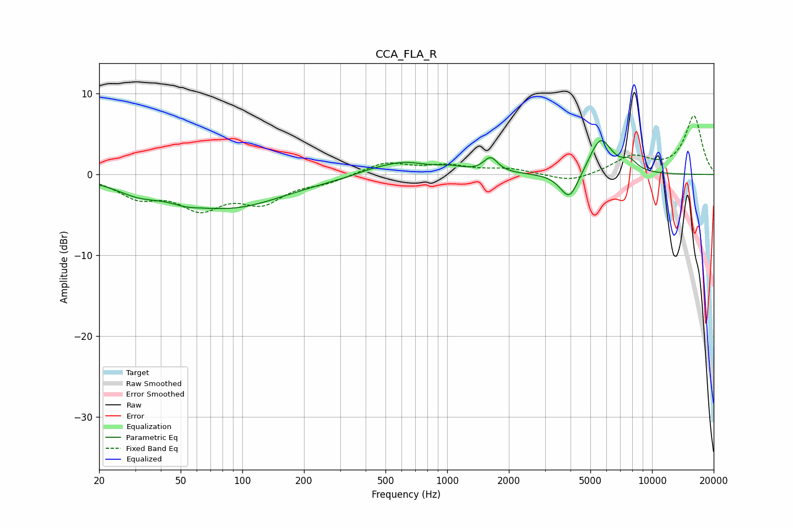

# CCA_FLA_R
See [usage instructions](https://github.com/jaakkopasanen/AutoEq#usage) for more options and info.

### Parametric EQs
Apply preamp of -4.3 dB when using parametric equalizer.

|   # | Type    |   Fc (Hz) |    Q |   Gain (dB) |
|-----|---------|-----------|------|-------------|
|   1 | Peaking |        31 | 1.34 |        -1.3 |
|   2 | Peaking |        53 | 2.13 |        -0.5 |
|   3 | Peaking |        86 | 0.52 |        -4   |
|   4 | Peaking |       422 | 1.71 |         0.4 |
|   5 | Peaking |       611 | 1.19 |         1.5 |
|   6 | Peaking |      1036 | 2.11 |         0.6 |
|   7 | Peaking |      1630 | 4.11 |         1.8 |
|   8 | Peaking |      3951 | 3.08 |        -3.5 |
|   9 | Peaking |      5600 | 2.52 |         4.6 |
|  10 | Peaking |      7779 | 3.54 |         1.2 |

### Fixed Band EQs
When using fixed band (also called graphic) equalizer, apply preamp of **-7.3 dB** (if available) and set gains manually with these parameters.

|   # | Type    |   Fc (Hz) |    Q |   Gain (dB) |
|-----|---------|-----------|------|-------------|
|   1 | Peaking |        31 | 1.41 |        -2.5 |
|   2 | Peaking |        62 | 1.41 |        -3.7 |
|   3 | Peaking |       125 | 1.41 |        -3.1 |
|   4 | Peaking |       250 | 1.41 |        -0.8 |
|   5 | Peaking |       500 | 1.41 |         1.5 |
|   6 | Peaking |      1000 | 1.41 |         1   |
|   7 | Peaking |      2000 | 1.41 |         0.7 |
|   8 | Peaking |      4000 | 1.41 |        -1   |
|   9 | Peaking |      8000 | 1.41 |         2.1 |
|  10 | Peaking |     16000 | 1.41 |         7.2 |

### Graphs

