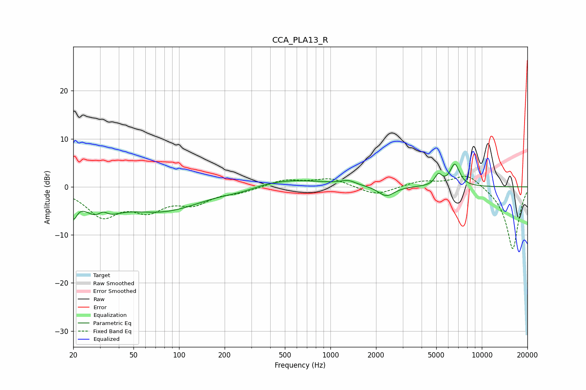

# CCA_PLA13_R
See [usage instructions](https://github.com/jaakkopasanen/AutoEq#usage) for more options and info.

### Parametric EQs
Apply preamp of -4.8 dB when using parametric equalizer.

|   # | Type    |   Fc (Hz) |    Q |   Gain (dB) |
|-----|---------|-----------|------|-------------|
|   1 | Peaking |        20 | 5.97 |        -3.9 |
|   2 | Peaking |        30 | 1.5  |        -5.1 |
|   3 | Peaking |        31 | 3.96 |         2   |
|   4 | Peaking |        78 | 0.54 |        -4.9 |
|   5 | Peaking |       256 | 1.32 |        -0.7 |
|   6 | Peaking |       511 | 0.55 |         1.7 |
|   7 | Peaking |      1311 | 3.04 |         0.9 |
|   8 | Peaking |      2340 | 2.65 |        -2.1 |
|   9 | Peaking |      5167 | 5.91 |         2.2 |
|  10 | Peaking |      6630 | 4.28 |         4.6 |

### Fixed Band EQs
When using fixed band (also called graphic) equalizer, apply preamp of **-2.3 dB** (if available) and set gains manually with these parameters.

|   # | Type    |   Fc (Hz) |    Q |   Gain (dB) |
|-----|---------|-----------|------|-------------|
|   1 | Peaking |        31 | 1.41 |        -5.8 |
|   2 | Peaking |        62 | 1.41 |        -4.1 |
|   3 | Peaking |       125 | 1.41 |        -3   |
|   4 | Peaking |       250 | 1.41 |        -0.9 |
|   5 | Peaking |       500 | 1.41 |         1.5 |
|   6 | Peaking |      1000 | 1.41 |         1.7 |
|   7 | Peaking |      2000 | 1.41 |        -1.8 |
|   8 | Peaking |      4000 | 1.41 |         1.2 |
|   9 | Peaking |      8000 | 1.41 |         2.9 |
|  10 | Peaking |     16000 | 1.41 |       -13.1 |

### Graphs

