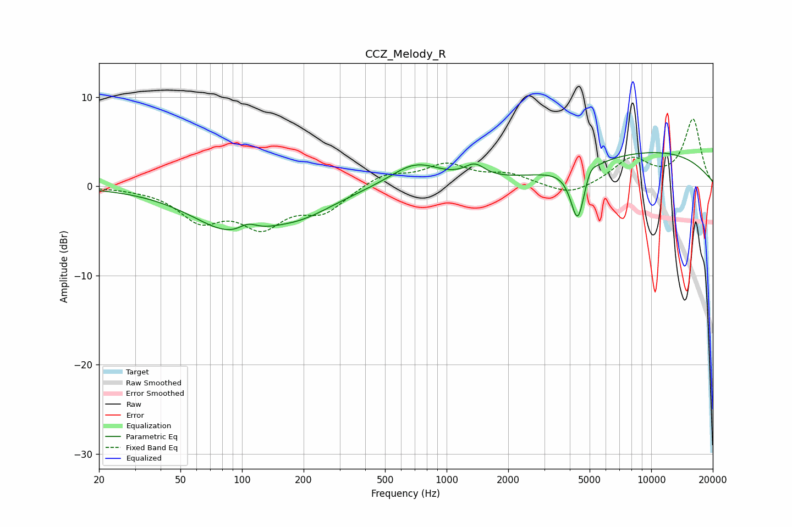

# CCZ_Melody_R
See [usage instructions](https://github.com/jaakkopasanen/AutoEq#usage) for more options and info.

### Parametric EQs
Apply preamp of -3.9 dB when using parametric equalizer.

|   # | Type    |   Fc (Hz) |    Q |   Gain (dB) |
|-----|---------|-----------|------|-------------|
|   1 | Peaking |        91 | 0.7  |        -4.8 |
|   2 | Peaking |       107 | 3.06 |         1   |
|   3 | Peaking |       188 | 1.19 |        -0.4 |
|   4 | Peaking |       208 | 0.8  |        -1.7 |
|   5 | Peaking |       704 | 1.15 |         2.6 |
|   6 | Peaking |      1373 | 2.84 |         1.5 |
|   7 | Peaking |      4370 | 4.06 |        -6   |
|   8 | Peaking |      4532 | 4.48 |        -0.3 |
|   9 | Peaking |      5013 | 5.01 |         1.1 |
|  10 | Peaking |     10000 | 0.31 |         3.8 |

### Fixed Band EQs
When using fixed band (also called graphic) equalizer, apply preamp of **-7.6 dB** (if available) and set gains manually with these parameters.

|   # | Type    |   Fc (Hz) |    Q |   Gain (dB) |
|-----|---------|-----------|------|-------------|
|   1 | Peaking |        31 | 1.41 |        -0.1 |
|   2 | Peaking |        62 | 1.41 |        -3.5 |
|   3 | Peaking |       125 | 1.41 |        -4   |
|   4 | Peaking |       250 | 1.41 |        -2.6 |
|   5 | Peaking |       500 | 1.41 |         1.4 |
|   6 | Peaking |      1000 | 1.41 |         2.3 |
|   7 | Peaking |      2000 | 1.41 |         1.2 |
|   8 | Peaking |      4000 | 1.41 |        -1.2 |
|   9 | Peaking |      8000 | 1.41 |         2.9 |
|  10 | Peaking |     16000 | 1.41 |         7.4 |

### Graphs

