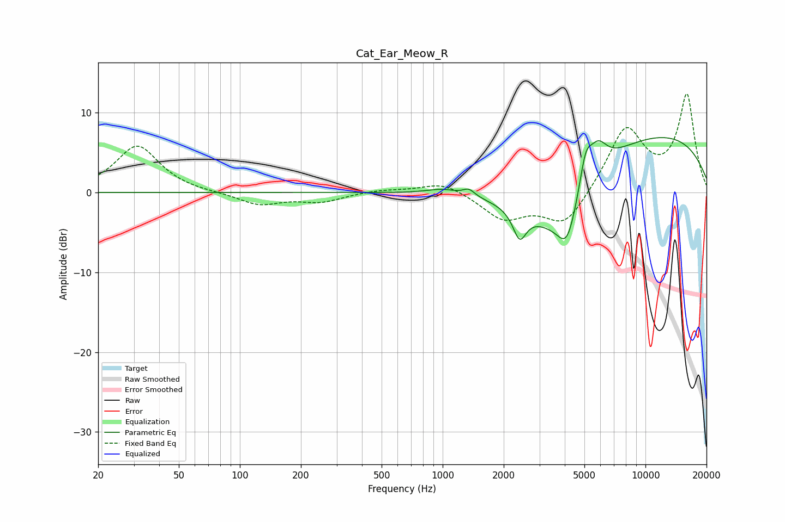

# Cat_Ear_Meow_R
See [usage instructions](https://github.com/jaakkopasanen/AutoEq#usage) for more options and info.

### Parametric EQs
Apply preamp of -7.0 dB when using parametric equalizer.

|   # | Type    |   Fc (Hz) |    Q |   Gain (dB) |
|-----|---------|-----------|------|-------------|
|   1 | Peaking |      1001 | 1.88 |         0.6 |
|   2 | Peaking |      1348 | 4.92 |         0.9 |
|   3 | Peaking |      2396 | 4.37 |        -3.5 |
|   4 | Peaking |      2963 | 1.56 |         0.4 |
|   5 | Peaking |      3430 | 0.75 |        -7.1 |
|   6 | Peaking |      4107 | 3.07 |        -4.3 |
|   7 | Peaking |      4118 | 1.21 |        -1.5 |
|   8 | Peaking |      5066 | 4.58 |         4.1 |
|   9 | Peaking |      5807 | 2.88 |         3.7 |
|  10 | Peaking |     10000 | 0.25 |         7.7 |

### Fixed Band EQs
When using fixed band (also called graphic) equalizer, apply preamp of **-12.4 dB** (if available) and set gains manually with these parameters.

|   # | Type    |   Fc (Hz) |    Q |   Gain (dB) |
|-----|---------|-----------|------|-------------|
|   1 | Peaking |        31 | 1.41 |         5.9 |
|   2 | Peaking |        62 | 1.41 |        -0.1 |
|   3 | Peaking |       125 | 1.41 |        -1.5 |
|   4 | Peaking |       250 | 1.41 |        -1.1 |
|   5 | Peaking |       500 | 1.41 |         0.3 |
|   6 | Peaking |      1000 | 1.41 |         1.4 |
|   7 | Peaking |      2000 | 1.41 |        -3.2 |
|   8 | Peaking |      4000 | 1.41 |        -4.3 |
|   9 | Peaking |      8000 | 1.41 |         8   |
|  10 | Peaking |     16000 | 1.41 |        12   |

### Graphs

