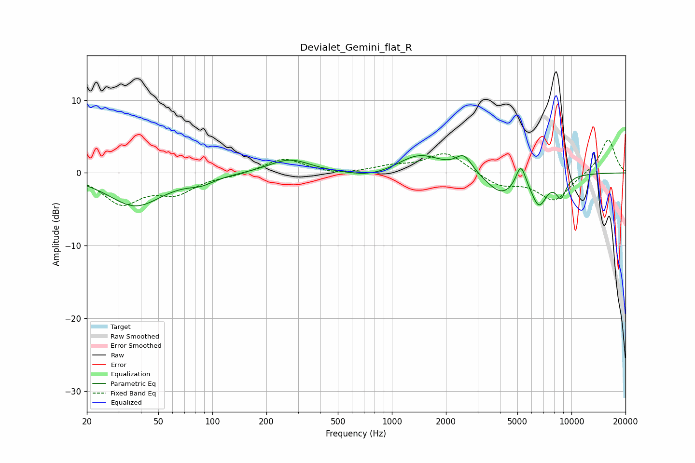

# Devialet_Gemini_flat_R
See [usage instructions](https://github.com/jaakkopasanen/AutoEq#usage) for more options and info.

### Parametric EQs
Apply preamp of -2.5 dB when using parametric equalizer.

|   # | Type    |   Fc (Hz) |    Q |   Gain (dB) |
|-----|---------|-----------|------|-------------|
|   1 | Peaking |        37 | 0.93 |        -4.5 |
|   2 | Peaking |        87 | 1.93 |        -0.9 |
|   3 | Peaking |       269 | 1.23 |         1.9 |
|   4 | Peaking |       783 | 1.01 |        -1   |
|   5 | Peaking |      1417 | 1.14 |         2.7 |
|   6 | Peaking |      2519 | 3.07 |         2.3 |
|   7 | Peaking |      4093 | 1.61 |        -3   |
|   8 | Peaking |      5226 | 5.07 |         3.2 |
|   9 | Peaking |      6595 | 3.17 |        -3.9 |
|  10 | Peaking |      8752 | 4.49 |        -2.7 |

### Fixed Band EQs
When using fixed band (also called graphic) equalizer, apply preamp of **-4.6 dB** (if available) and set gains manually with these parameters.

|   # | Type    |   Fc (Hz) |    Q |   Gain (dB) |
|-----|---------|-----------|------|-------------|
|   1 | Peaking |        31 | 1.41 |        -4   |
|   2 | Peaking |        62 | 1.41 |        -2.5 |
|   3 | Peaking |       125 | 1.41 |        -0.3 |
|   4 | Peaking |       250 | 1.41 |         2   |
|   5 | Peaking |       500 | 1.41 |        -0.4 |
|   6 | Peaking |      1000 | 1.41 |         0.8 |
|   7 | Peaking |      2000 | 1.41 |         2.8 |
|   8 | Peaking |      4000 | 1.41 |        -1.7 |
|   9 | Peaking |      8000 | 1.41 |        -3.8 |
|  10 | Peaking |     16000 | 1.41 |         4.7 |

### Graphs

