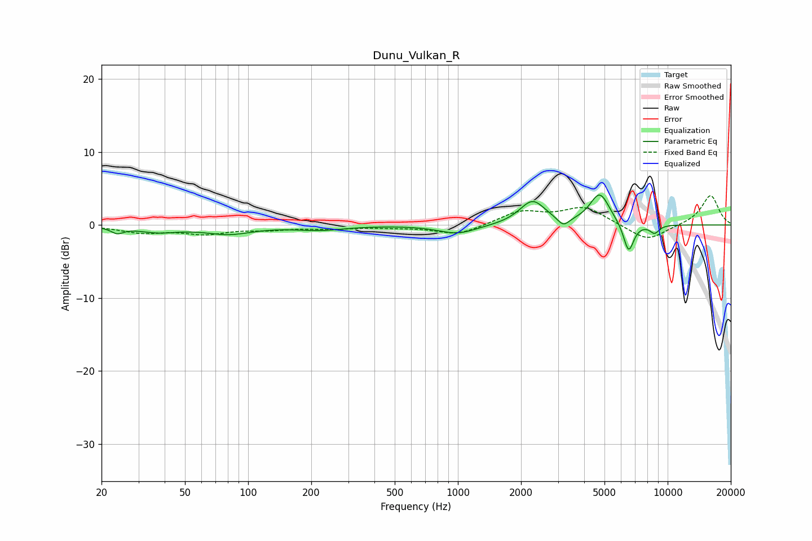

# Dunu_Vulkan_R
See [usage instructions](https://github.com/jaakkopasanen/AutoEq#usage) for more options and info.

### Parametric EQs
Apply preamp of -4.2 dB when using parametric equalizer.

|   # | Type    |   Fc (Hz) |    Q |   Gain (dB) |
|-----|---------|-----------|------|-------------|
|   1 | Peaking |        24 | 4.8  |        -0.8 |
|   2 | Peaking |        37 | 1.46 |        -0.8 |
|   3 | Peaking |        81 | 1.24 |        -1.1 |
|   4 | Peaking |       220 | 1.21 |        -0.6 |
|   5 | Peaking |       996 | 1.56 |        -1.2 |
|   6 | Peaking |      2268 | 2.3  |         3.3 |
|   7 | Peaking |      3185 | 5.02 |        -1.2 |
|   8 | Peaking |      4746 | 2.95 |         4.3 |
|   9 | Peaking |      6515 | 5.45 |        -4.1 |
|  10 | Peaking |      8661 | 5.71 |        -1.1 |

### Fixed Band EQs
When using fixed band (also called graphic) equalizer, apply preamp of **-4.1 dB** (if available) and set gains manually with these parameters.

|   # | Type    |   Fc (Hz) |    Q |   Gain (dB) |
|-----|---------|-----------|------|-------------|
|   1 | Peaking |        31 | 1.41 |        -1   |
|   2 | Peaking |        62 | 1.41 |        -1.1 |
|   3 | Peaking |       125 | 1.41 |        -0.5 |
|   4 | Peaking |       250 | 1.41 |        -0.4 |
|   5 | Peaking |       500 | 1.41 |        -0.2 |
|   6 | Peaking |      1000 | 1.41 |        -1.4 |
|   7 | Peaking |      2000 | 1.41 |         1.8 |
|   8 | Peaking |      4000 | 1.41 |         2.4 |
|   9 | Peaking |      8000 | 1.41 |        -2.3 |
|  10 | Peaking |     16000 | 1.41 |         4.1 |

### Graphs

