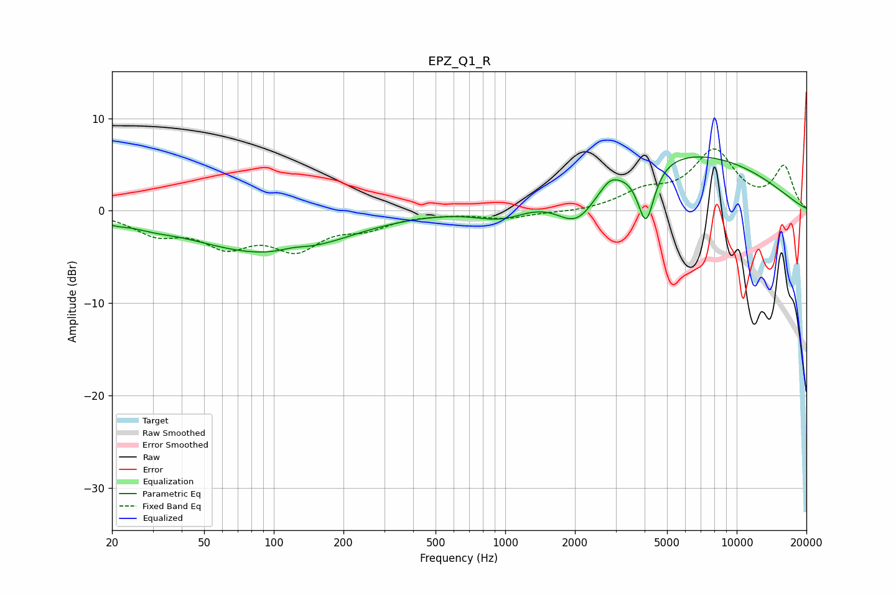

# EPZ_Q1_R
See [usage instructions](https://github.com/jaakkopasanen/AutoEq#usage) for more options and info.

### Parametric EQs
Apply preamp of -5.9 dB when using parametric equalizer.

|   # | Type    |   Fc (Hz) |    Q |   Gain (dB) |
|-----|---------|-----------|------|-------------|
|   1 | Peaking |        21 | 2.78 |        -0.4 |
|   2 | Peaking |        30 | 1.59 |        -0.5 |
|   3 | Peaking |        90 | 0.45 |        -4.4 |
|   4 | Peaking |       121 | 2.5  |         0.4 |
|   5 | Peaking |       163 | 0.96 |        -0.4 |
|   6 | Peaking |       972 | 1.18 |        -1.8 |
|   7 | Peaking |      2045 | 1.5  |        -4.6 |
|   8 | Peaking |      2822 | 3.63 |         0.9 |
|   9 | Peaking |      4054 | 3.82 |        -6.4 |
|  10 | Peaking |      5315 | 0.3  |         6.5 |

### Fixed Band EQs
When using fixed band (also called graphic) equalizer, apply preamp of **-6.8 dB** (if available) and set gains manually with these parameters.

|   # | Type    |   Fc (Hz) |    Q |   Gain (dB) |
|-----|---------|-----------|------|-------------|
|   1 | Peaking |        31 | 1.41 |        -2.2 |
|   2 | Peaking |        62 | 1.41 |        -3.3 |
|   3 | Peaking |       125 | 1.41 |        -3.7 |
|   4 | Peaking |       250 | 1.41 |        -1.5 |
|   5 | Peaking |       500 | 1.41 |        -0.2 |
|   6 | Peaking |      1000 | 1.41 |        -0.8 |
|   7 | Peaking |      2000 | 1.41 |        -0.2 |
|   8 | Peaking |      4000 | 1.41 |         1.8 |
|   9 | Peaking |      8000 | 1.41 |         6.2 |
|  10 | Peaking |     16000 | 1.41 |         4.6 |

### Graphs

