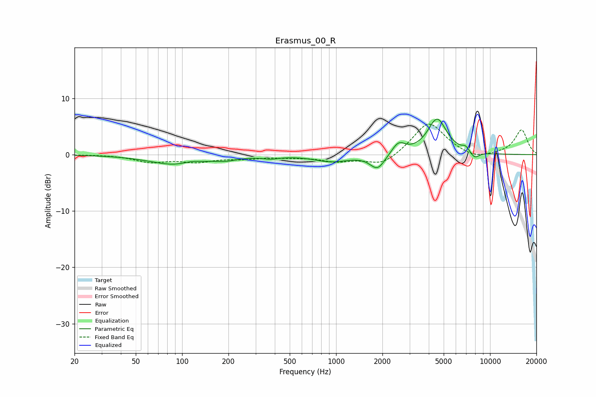

# Erasmus_00_R
See [usage instructions](https://github.com/jaakkopasanen/AutoEq#usage) for more options and info.

### Parametric EQs
Apply preamp of -6.4 dB when using parametric equalizer.

|   # | Type    |   Fc (Hz) |    Q |   Gain (dB) |
|-----|---------|-----------|------|-------------|
|   1 | Peaking |        92 | 0.84 |        -1.8 |
|   2 | Peaking |       113 | 2.57 |         0.4 |
|   3 | Peaking |       194 | 1.94 |        -0.5 |
|   4 | Peaking |       377 | 2.55 |        -0.5 |
|   5 | Peaking |       937 | 1.28 |        -1.2 |
|   6 | Peaking |      1860 | 2.91 |        -2.7 |
|   7 | Peaking |      2541 | 3.26 |         2   |
|   8 | Peaking |      4531 | 2.25 |         6.3 |
|   9 | Peaking |      6947 | 6    |         0.8 |
|  10 | Peaking |      7937 | 4.42 |        -1.2 |

### Fixed Band EQs
When using fixed band (also called graphic) equalizer, apply preamp of **-5.5 dB** (if available) and set gains manually with these parameters.

|   # | Type    |   Fc (Hz) |    Q |   Gain (dB) |
|-----|---------|-----------|------|-------------|
|   1 | Peaking |        31 | 1.41 |         0   |
|   2 | Peaking |        62 | 1.41 |        -1.2 |
|   3 | Peaking |       125 | 1.41 |        -1.1 |
|   4 | Peaking |       250 | 1.41 |        -0.6 |
|   5 | Peaking |       500 | 1.41 |        -0.3 |
|   6 | Peaking |      1000 | 1.41 |        -1.1 |
|   7 | Peaking |      2000 | 1.41 |        -2   |
|   8 | Peaking |      4000 | 1.41 |         5.9 |
|   9 | Peaking |      8000 | 1.41 |        -1   |
|  10 | Peaking |     16000 | 1.41 |         4.4 |

### Graphs

