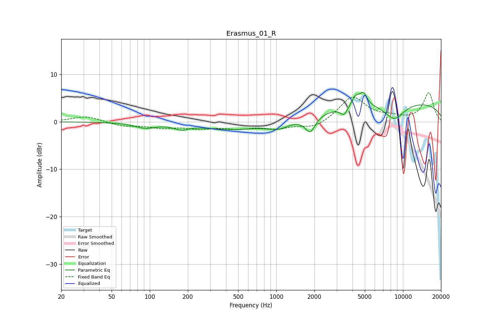

# Erasmus_01_R
See [usage instructions](https://github.com/jaakkopasanen/AutoEq#usage) for more options and info.

### Parametric EQs
Apply preamp of -6.3 dB when using parametric equalizer.

|   # | Type    |   Fc (Hz) |    Q |   Gain (dB) |
|-----|---------|-----------|------|-------------|
|   1 | Peaking |        92 | 1.73 |        -1.1 |
|   2 | Peaking |       177 | 2.53 |        -1   |
|   3 | Peaking |       451 | 0.56 |        -1.6 |
|   4 | Peaking |      1046 | 1.56 |        -1.5 |
|   5 | Peaking |      1854 | 3.42 |        -3.4 |
|   6 | Peaking |      3430 | 4.78 |        -1.8 |
|   7 | Peaking |      4256 | 4.01 |         2.1 |
|   8 | Peaking |      4896 | 5.25 |         2.3 |
|   9 | Peaking |      8575 | 1.61 |        -3.5 |
|  10 | Peaking |      9332 | 0.18 |         4.3 |

### Fixed Band EQs
When using fixed band (also called graphic) equalizer, apply preamp of **-6.2 dB** (if available) and set gains manually with these parameters.

|   # | Type    |   Fc (Hz) |    Q |   Gain (dB) |
|-----|---------|-----------|------|-------------|
|   1 | Peaking |        31 | 1.41 |         1.2 |
|   2 | Peaking |        62 | 1.41 |        -0.9 |
|   3 | Peaking |       125 | 1.41 |        -1.1 |
|   4 | Peaking |       250 | 1.41 |        -1.2 |
|   5 | Peaking |       500 | 1.41 |        -1.1 |
|   6 | Peaking |      1000 | 1.41 |        -1.2 |
|   7 | Peaking |      2000 | 1.41 |        -1.4 |
|   8 | Peaking |      4000 | 1.41 |         5.3 |
|   9 | Peaking |      8000 | 1.41 |         0.8 |
|  10 | Peaking |     16000 | 1.41 |         6.1 |

### Graphs

