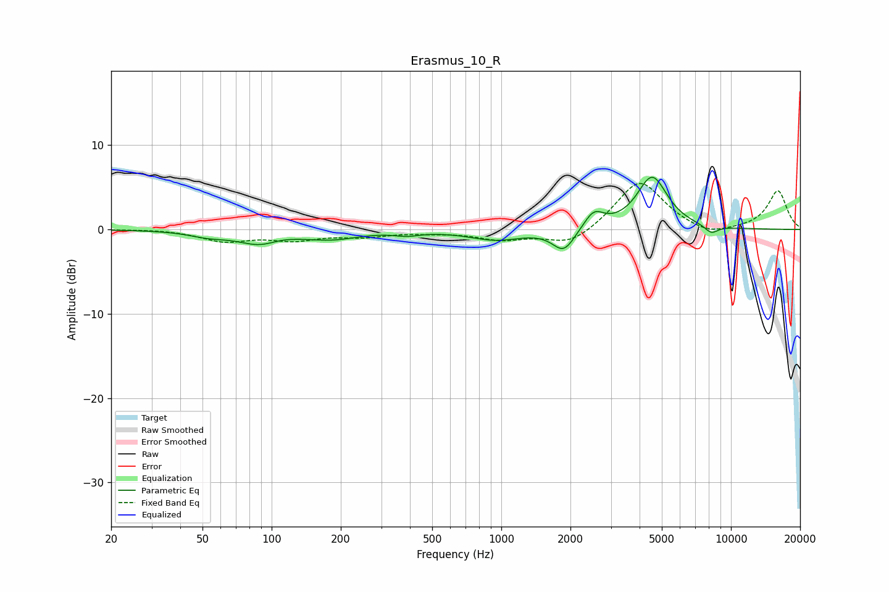

# Erasmus_10_R
See [usage instructions](https://github.com/jaakkopasanen/AutoEq#usage) for more options and info.

### Parametric EQs
Apply preamp of -6.3 dB when using parametric equalizer.

|   # | Type    |   Fc (Hz) |    Q |   Gain (dB) |
|-----|---------|-----------|------|-------------|
|   1 | Peaking |        52 | 1.77 |        -0.6 |
|   2 | Peaking |        91 | 1.37 |        -1.8 |
|   3 | Peaking |       107 | 2.05 |         0.5 |
|   4 | Peaking |       184 | 1.22 |        -0.9 |
|   5 | Peaking |       389 | 2.72 |        -0.4 |
|   6 | Peaking |       949 | 1.23 |        -1.2 |
|   7 | Peaking |      1871 | 2.9  |        -2.7 |
|   8 | Peaking |      2527 | 3.25 |         2   |
|   9 | Peaking |      4537 | 2.11 |         6.2 |
|  10 | Peaking |      8208 | 4.39 |        -0.9 |

### Fixed Band EQs
When using fixed band (also called graphic) equalizer, apply preamp of **-5.6 dB** (if available) and set gains manually with these parameters.

|   # | Type    |   Fc (Hz) |    Q |   Gain (dB) |
|-----|---------|-----------|------|-------------|
|   1 | Peaking |        31 | 1.41 |         0.1 |
|   2 | Peaking |        62 | 1.41 |        -1.3 |
|   3 | Peaking |       125 | 1.41 |        -1.1 |
|   4 | Peaking |       250 | 1.41 |        -0.7 |
|   5 | Peaking |       500 | 1.41 |        -0.2 |
|   6 | Peaking |      1000 | 1.41 |        -1.1 |
|   7 | Peaking |      2000 | 1.41 |        -2   |
|   8 | Peaking |      4000 | 1.41 |         5.9 |
|   9 | Peaking |      8000 | 1.41 |        -1   |
|  10 | Peaking |     16000 | 1.41 |         4.6 |

### Graphs

