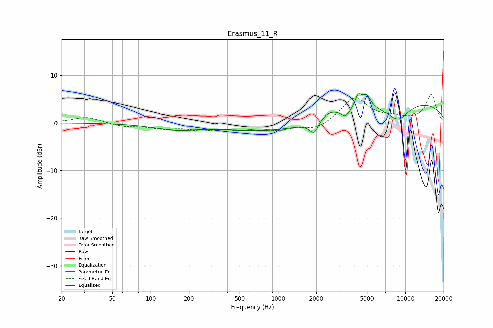

# Erasmus_11_R
See [usage instructions](https://github.com/jaakkopasanen/AutoEq#usage) for more options and info.

### Parametric EQs
Apply preamp of -6.2 dB when using parametric equalizer.

|   # | Type    |   Fc (Hz) |    Q |   Gain (dB) |
|-----|---------|-----------|------|-------------|
|   1 | Peaking |       156 | 0.77 |        -1.2 |
|   2 | Peaking |      1490 | 0.27 |        -2.4 |
|   3 | Peaking |      1765 | 3.5  |        -0.3 |
|   4 | Peaking |      1930 | 3.98 |        -2.6 |
|   5 | Peaking |      2517 | 1.65 |         1.8 |
|   6 | Peaking |      3383 | 4.61 |        -1.5 |
|   7 | Peaking |      4268 | 5.09 |         2.8 |
|   8 | Peaking |      4963 | 4.21 |         2.6 |
|   9 | Peaking |      8677 | 0.21 |         5   |
|  10 | Peaking |      8770 | 1.43 |        -3.7 |

### Fixed Band EQs
When using fixed band (also called graphic) equalizer, apply preamp of **-6.1 dB** (if available) and set gains manually with these parameters.

|   # | Type    |   Fc (Hz) |    Q |   Gain (dB) |
|-----|---------|-----------|------|-------------|
|   1 | Peaking |        31 | 1.41 |         1.3 |
|   2 | Peaking |        62 | 1.41 |        -0.7 |
|   3 | Peaking |       125 | 1.41 |        -1   |
|   4 | Peaking |       250 | 1.41 |        -1.2 |
|   5 | Peaking |       500 | 1.41 |        -1.1 |
|   6 | Peaking |      1000 | 1.41 |        -1.2 |
|   7 | Peaking |      2000 | 1.41 |        -1.5 |
|   8 | Peaking |      4000 | 1.41 |         5.3 |
|   9 | Peaking |      8000 | 1.41 |         0.9 |
|  10 | Peaking |     16000 | 1.41 |         5.9 |

### Graphs

