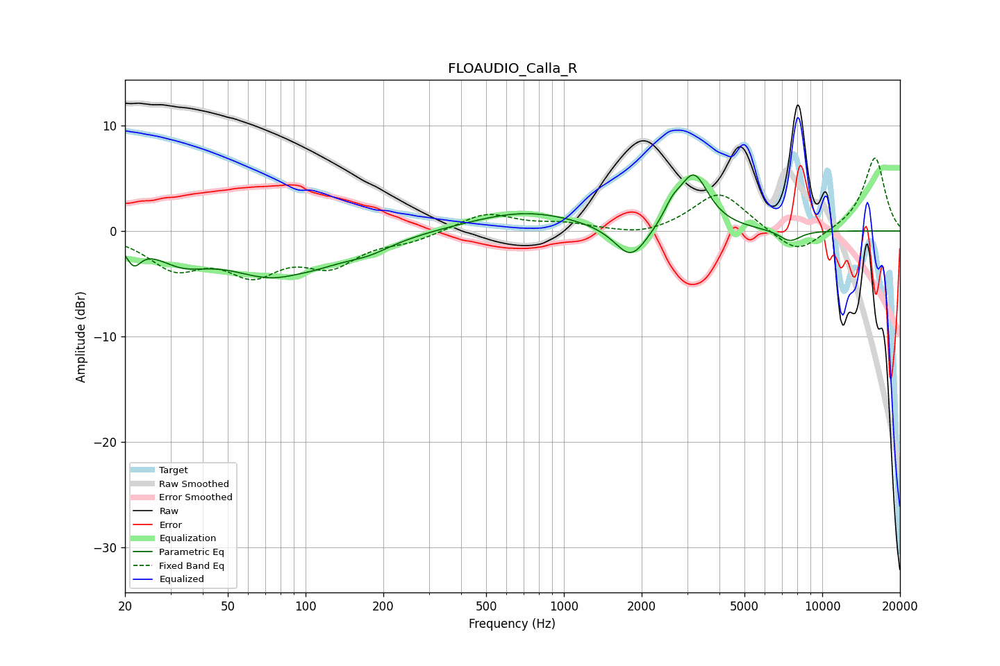

# FLOAUDIO_Calla_R
See [usage instructions](https://github.com/jaakkopasanen/AutoEq#usage) for more options and info.

### Parametric EQs
Apply preamp of -5.4 dB when using parametric equalizer.

|   # | Type    |   Fc (Hz) |    Q |   Gain (dB) |
|-----|---------|-----------|------|-------------|
|   1 | Peaking |        22 | 5.14 |        -1.9 |
|   2 | Peaking |        33 | 1.4  |        -2   |
|   3 | Peaking |        81 | 0.71 |        -4.4 |
|   4 | Peaking |        90 | 1.98 |         0.4 |
|   5 | Peaking |       176 | 1.55 |        -0.8 |
|   6 | Peaking |       709 | 0.66 |         1.9 |
|   7 | Peaking |      1821 | 2.22 |        -3.3 |
|   8 | Peaking |      2624 | 4.39 |         1.2 |
|   9 | Peaking |      3180 | 2.44 |         5.3 |
|  10 | Peaking |      7496 | 3.13 |        -1.1 |

### Fixed Band EQs
When using fixed band (also called graphic) equalizer, apply preamp of **-7.0 dB** (if available) and set gains manually with these parameters.

|   # | Type    |   Fc (Hz) |    Q |   Gain (dB) |
|-----|---------|-----------|------|-------------|
|   1 | Peaking |        31 | 1.41 |        -3.2 |
|   2 | Peaking |        62 | 1.41 |        -3.5 |
|   3 | Peaking |       125 | 1.41 |        -2.9 |
|   4 | Peaking |       250 | 1.41 |        -0.8 |
|   5 | Peaking |       500 | 1.41 |         1.7 |
|   6 | Peaking |      1000 | 1.41 |         0.6 |
|   7 | Peaking |      2000 | 1.41 |        -0.6 |
|   8 | Peaking |      4000 | 1.41 |         3.8 |
|   9 | Peaking |      8000 | 1.41 |        -2.4 |
|  10 | Peaking |     16000 | 1.41 |         7   |

### Graphs

