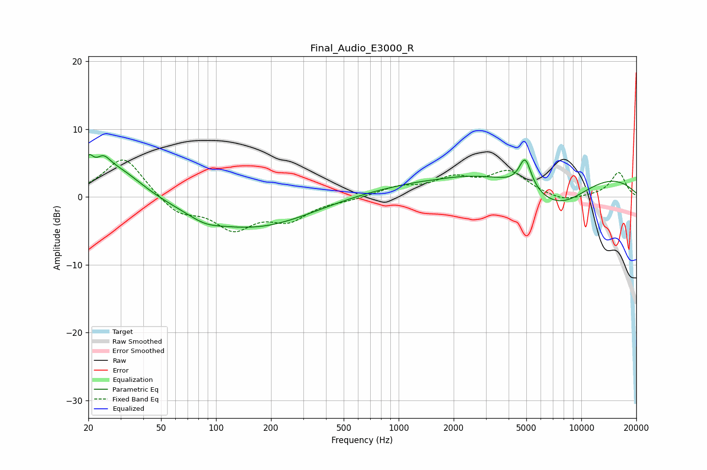

# Final_Audio_E3000_R
See [usage instructions](https://github.com/jaakkopasanen/AutoEq#usage) for more options and info.

### Parametric EQs
Apply preamp of -6.3 dB when using parametric equalizer.

|   # | Type    |   Fc (Hz) |    Q |   Gain (dB) |
|-----|---------|-----------|------|-------------|
|   1 | Peaking |        20 | 5.68 |         2.9 |
|   2 | Peaking |        24 | 3.61 |         2.2 |
|   3 | Peaking |        29 | 1    |         4.4 |
|   4 | Peaking |        87 | 1.7  |        -0.9 |
|   5 | Peaking |       162 | 0.42 |        -4.8 |
|   6 | Peaking |       648 | 0.41 |         1   |
|   7 | Peaking |      1635 | 2.91 |        -0.1 |
|   8 | Peaking |      4927 | 4.18 |         4.4 |
|   9 | Peaking |      6797 | 0.2  |         5   |
|  10 | Peaking |      7394 | 0.71 |        -5.8 |

### Fixed Band EQs
When using fixed band (also called graphic) equalizer, apply preamp of **-5.5 dB** (if available) and set gains manually with these parameters.

|   # | Type    |   Fc (Hz) |    Q |   Gain (dB) |
|-----|---------|-----------|------|-------------|
|   1 | Peaking |        31 | 1.41 |         6.1 |
|   2 | Peaking |        62 | 1.41 |        -2.5 |
|   3 | Peaking |       125 | 1.41 |        -4.4 |
|   4 | Peaking |       250 | 1.41 |        -3   |
|   5 | Peaking |       500 | 1.41 |        -0.4 |
|   6 | Peaking |      1000 | 1.41 |         1.3 |
|   7 | Peaking |      2000 | 1.41 |         2.4 |
|   8 | Peaking |      4000 | 1.41 |         3.5 |
|   9 | Peaking |      8000 | 1.41 |        -0.9 |
|  10 | Peaking |     16000 | 1.41 |         3.6 |

### Graphs

