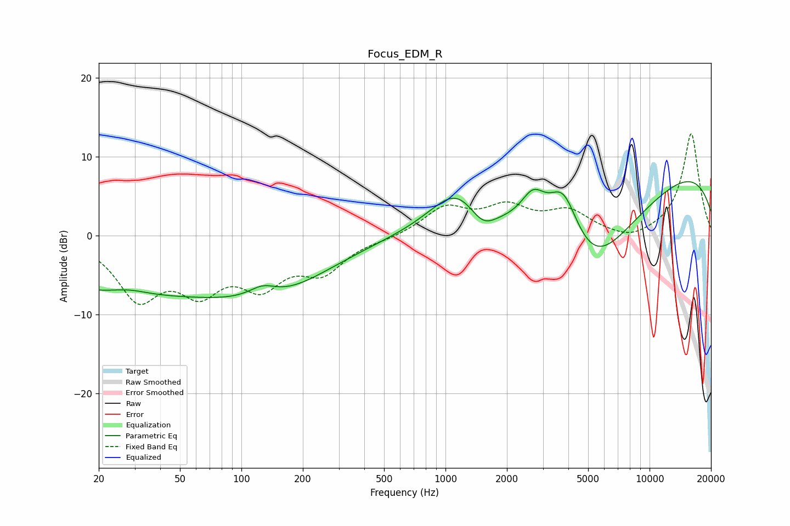

# Focus_EDM_R
See [usage instructions](https://github.com/jaakkopasanen/AutoEq#usage) for more options and info.

### Parametric EQs
Apply preamp of -6.9 dB when using parametric equalizer.

|   # | Type    |   Fc (Hz) |    Q |   Gain (dB) |
|-----|---------|-----------|------|-------------|
|   1 | Peaking |        26 | 0.22 |        -7   |
|   2 | Peaking |        28 | 1.62 |         0.6 |
|   3 | Peaking |       127 | 2.05 |         1.6 |
|   4 | Peaking |       155 | 0.52 |        -4.8 |
|   5 | Peaking |      1140 | 1.07 |         5.3 |
|   6 | Peaking |      1520 | 2.08 |        -2.7 |
|   7 | Peaking |      2686 | 2.38 |         3.8 |
|   8 | Peaking |      3787 | 1.8  |         7.2 |
|   9 | Peaking |      5159 | 0.52 |       -14.4 |
|  10 | Peaking |      9064 | 0.18 |        11   |

### Fixed Band EQs
When using fixed band (also called graphic) equalizer, apply preamp of **-13.0 dB** (if available) and set gains manually with these parameters.

|   # | Type    |   Fc (Hz) |    Q |   Gain (dB) |
|-----|---------|-----------|------|-------------|
|   1 | Peaking |        31 | 1.41 |        -7.4 |
|   2 | Peaking |        62 | 1.41 |        -5.8 |
|   3 | Peaking |       125 | 1.41 |        -5.4 |
|   4 | Peaking |       250 | 1.41 |        -4.1 |
|   5 | Peaking |       500 | 1.41 |        -0.3 |
|   6 | Peaking |      1000 | 1.41 |         3.4 |
|   7 | Peaking |      2000 | 1.41 |         3.2 |
|   8 | Peaking |      4000 | 1.41 |         2.8 |
|   9 | Peaking |      8000 | 1.41 |        -1   |
|  10 | Peaking |     16000 | 1.41 |        13   |

### Graphs

