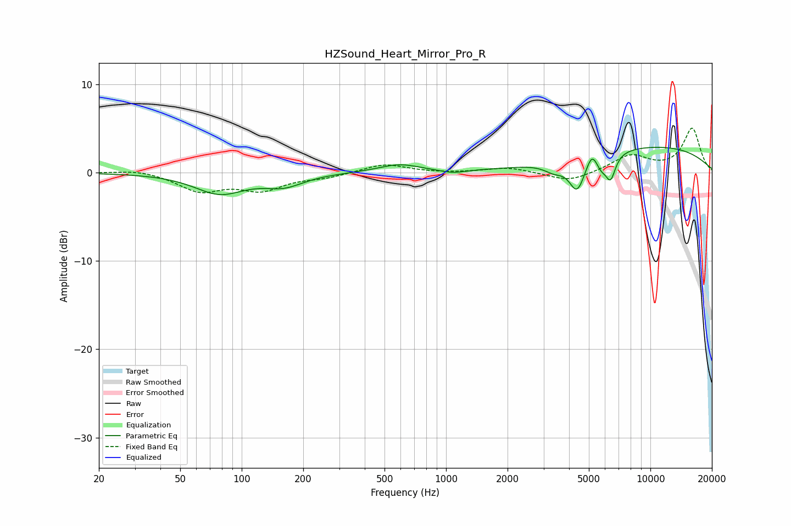

# HZSound_Heart_Mirror_Pro_R
See [usage instructions](https://github.com/jaakkopasanen/AutoEq#usage) for more options and info.

### Parametric EQs
Apply preamp of -3.0 dB when using parametric equalizer.

|   # | Type    |   Fc (Hz) |    Q |   Gain (dB) |
|-----|---------|-----------|------|-------------|
|   1 | Peaking |        78 | 1.15 |        -2.3 |
|   2 | Peaking |       161 | 1.47 |        -1.3 |
|   3 | Peaking |       591 | 1.35 |         0.9 |
|   4 | Peaking |      1076 | 2.32 |        -0.4 |
|   5 | Peaking |      3382 | 2.83 |        -1   |
|   6 | Peaking |      4378 | 3.65 |        -3.6 |
|   7 | Peaking |      5167 | 5.77 |         1.4 |
|   8 | Peaking |      5756 | 5.79 |        -1.1 |
|   9 | Peaking |      6381 | 5.59 |        -2.8 |
|  10 | Peaking |     10000 | 0.31 |         3   |

### Fixed Band EQs
When using fixed band (also called graphic) equalizer, apply preamp of **-5.1 dB** (if available) and set gains manually with these parameters.

|   # | Type    |   Fc (Hz) |    Q |   Gain (dB) |
|-----|---------|-----------|------|-------------|
|   1 | Peaking |        31 | 1.41 |         0.4 |
|   2 | Peaking |        62 | 1.41 |        -2   |
|   3 | Peaking |       125 | 1.41 |        -1.8 |
|   4 | Peaking |       250 | 1.41 |        -0.5 |
|   5 | Peaking |       500 | 1.41 |         1   |
|   6 | Peaking |      1000 | 1.41 |        -0.1 |
|   7 | Peaking |      2000 | 1.41 |         0.6 |
|   8 | Peaking |      4000 | 1.41 |        -1.1 |
|   9 | Peaking |      8000 | 1.41 |         1.9 |
|  10 | Peaking |     16000 | 1.41 |         5   |

### Graphs

