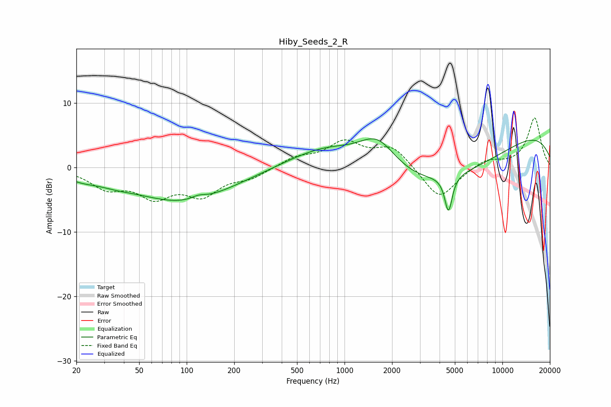

# Hiby_Seeds_2_R
See [usage instructions](https://github.com/jaakkopasanen/AutoEq#usage) for more options and info.

### Parametric EQs
Apply preamp of -4.6 dB when using parametric equalizer.

|   # | Type    |   Fc (Hz) |    Q |   Gain (dB) |
|-----|---------|-----------|------|-------------|
|   1 | Peaking |        22 | 1.35 |        -1   |
|   2 | Peaking |        36 | 1.26 |        -0.7 |
|   3 | Peaking |        95 | 0.44 |        -5.2 |
|   4 | Peaking |       118 | 3.18 |         0.6 |
|   5 | Peaking |       651 | 1.25 |        -0.1 |
|   6 | Peaking |       783 | 0.6  |         3.9 |
|   7 | Peaking |      1622 | 1.13 |         5.5 |
|   8 | Peaking |      4207 | 0.3  |        -7.7 |
|   9 | Peaking |      4554 | 5.95 |        -5.6 |
|  10 | Peaking |     10000 | 0.23 |         7.2 |

### Fixed Band EQs
When using fixed band (also called graphic) equalizer, apply preamp of **-7.8 dB** (if available) and set gains manually with these parameters.

|   # | Type    |   Fc (Hz) |    Q |   Gain (dB) |
|-----|---------|-----------|------|-------------|
|   1 | Peaking |        31 | 1.41 |        -2.9 |
|   2 | Peaking |        62 | 1.41 |        -4   |
|   3 | Peaking |       125 | 1.41 |        -3.9 |
|   4 | Peaking |       250 | 1.41 |        -1.4 |
|   5 | Peaking |       500 | 1.41 |         1.5 |
|   6 | Peaking |      1000 | 1.41 |         3.7 |
|   7 | Peaking |      2000 | 1.41 |         3.2 |
|   8 | Peaking |      4000 | 1.41 |        -5.1 |
|   9 | Peaking |      8000 | 1.41 |         1.3 |
|  10 | Peaking |     16000 | 1.41 |         7.7 |

### Graphs

