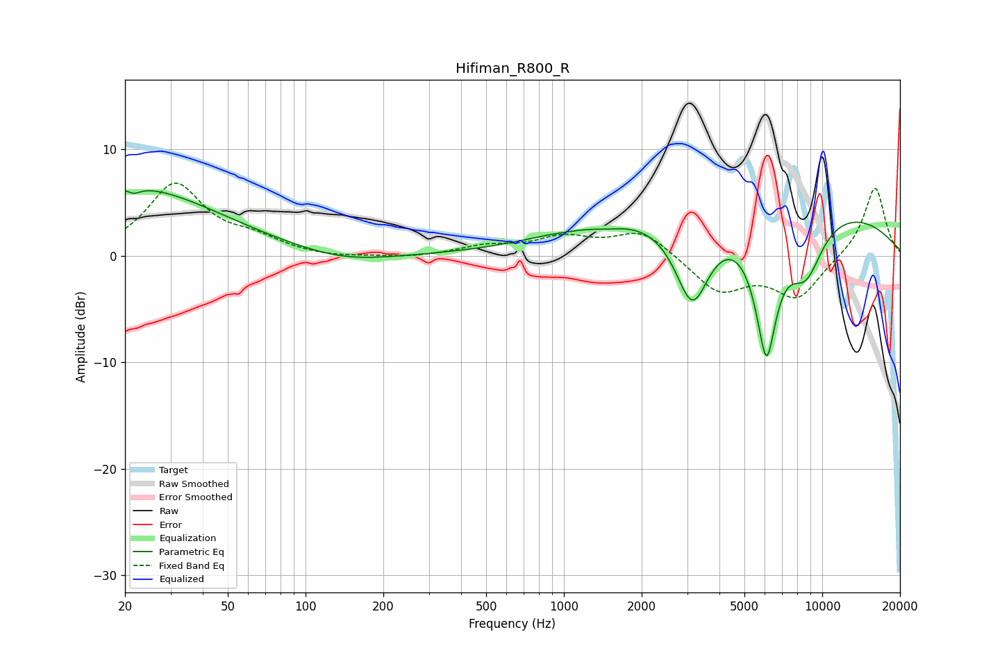

# Hifiman_R800_R
See [usage instructions](https://github.com/jaakkopasanen/AutoEq#usage) for more options and info.

### Parametric EQs
Apply preamp of -6.2 dB when using parametric equalizer.

|   # | Type    |   Fc (Hz) |    Q |   Gain (dB) |
|-----|---------|-----------|------|-------------|
|   1 | Peaking |        21 | 0.41 |         6.5 |
|   2 | Peaking |        22 | 5.55 |        -0.6 |
|   3 | Peaking |       140 | 0.78 |        -0.9 |
|   4 | Peaking |       841 | 2.29 |         0.1 |
|   5 | Peaking |      1485 | 2.57 |        -0.2 |
|   6 | Peaking |      3142 | 2.05 |        -8.3 |
|   7 | Peaking |      5662 | 0.18 |         5.4 |
|   8 | Peaking |      5970 | 5.95 |         1.1 |
|   9 | Peaking |      6061 | 3.24 |       -13.4 |
|  10 | Peaking |      8621 | 1.85 |        -5.4 |

### Fixed Band EQs
When using fixed band (also called graphic) equalizer, apply preamp of **-6.9 dB** (if available) and set gains manually with these parameters.

|   # | Type    |   Fc (Hz) |    Q |   Gain (dB) |
|-----|---------|-----------|------|-------------|
|   1 | Peaking |        31 | 1.41 |         6.6 |
|   2 | Peaking |        62 | 1.41 |         1.3 |
|   3 | Peaking |       125 | 1.41 |        -0.3 |
|   4 | Peaking |       250 | 1.41 |        -0.2 |
|   5 | Peaking |       500 | 1.41 |         0.8 |
|   6 | Peaking |      1000 | 1.41 |         1.6 |
|   7 | Peaking |      2000 | 1.41 |         2.4 |
|   8 | Peaking |      4000 | 1.41 |        -3.3 |
|   9 | Peaking |      8000 | 1.41 |        -3.9 |
|  10 | Peaking |     16000 | 1.41 |         6.6 |

### Graphs

