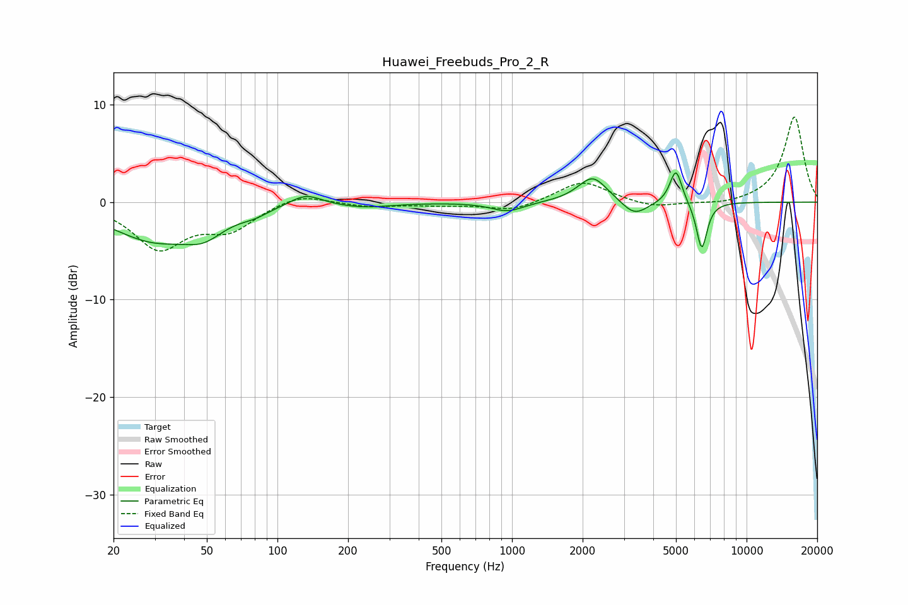

# Huawei_Freebuds_Pro_2_R
See [usage instructions](https://github.com/jaakkopasanen/AutoEq#usage) for more options and info.

### Parametric EQs
Apply preamp of -3.1 dB when using parametric equalizer.

|   # | Type    |   Fc (Hz) |    Q |   Gain (dB) |
|-----|---------|-----------|------|-------------|
|   1 | Peaking |        30 | 0.78 |        -3.7 |
|   2 | Peaking |        49 | 1.64 |        -1.9 |
|   3 | Peaking |        80 | 2.35 |        -0.5 |
|   4 | Peaking |       132 | 2.07 |         1.2 |
|   5 | Peaking |       233 | 1.18 |        -0.5 |
|   6 | Peaking |       957 | 2.05 |        -1   |
|   7 | Peaking |      2208 | 2.26 |         2.7 |
|   8 | Peaking |      3329 | 2.56 |        -1.6 |
|   9 | Peaking |      4998 | 5.43 |         3.5 |
|  10 | Peaking |      6439 | 6    |        -4.9 |

### Fixed Band EQs
When using fixed band (also called graphic) equalizer, apply preamp of **-8.8 dB** (if available) and set gains manually with these parameters.

|   # | Type    |   Fc (Hz) |    Q |   Gain (dB) |
|-----|---------|-----------|------|-------------|
|   1 | Peaking |        31 | 1.41 |        -4.6 |
|   2 | Peaking |        62 | 1.41 |        -2.5 |
|   3 | Peaking |       125 | 1.41 |         1   |
|   4 | Peaking |       250 | 1.41 |        -0.5 |
|   5 | Peaking |       500 | 1.41 |        -0.3 |
|   6 | Peaking |      1000 | 1.41 |        -0.9 |
|   7 | Peaking |      2000 | 1.41 |         2.2 |
|   8 | Peaking |      4000 | 1.41 |        -0.7 |
|   9 | Peaking |      8000 | 1.41 |        -0.3 |
|  10 | Peaking |     16000 | 1.41 |         8.8 |

### Graphs

